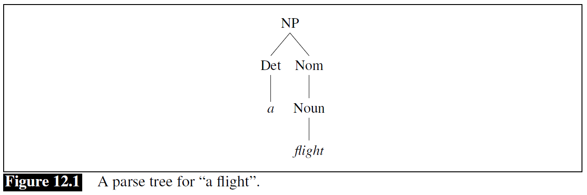
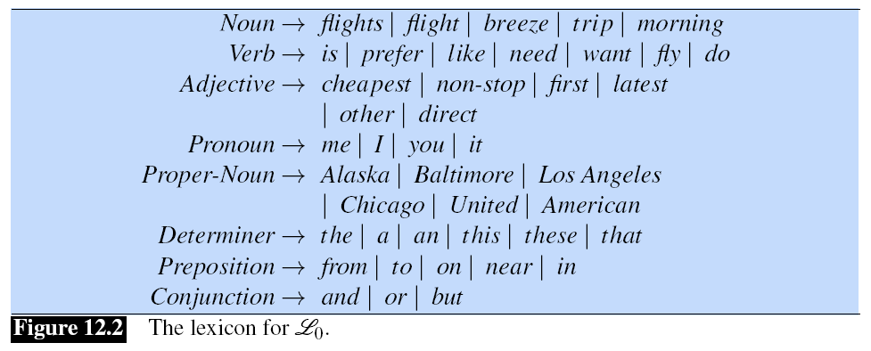
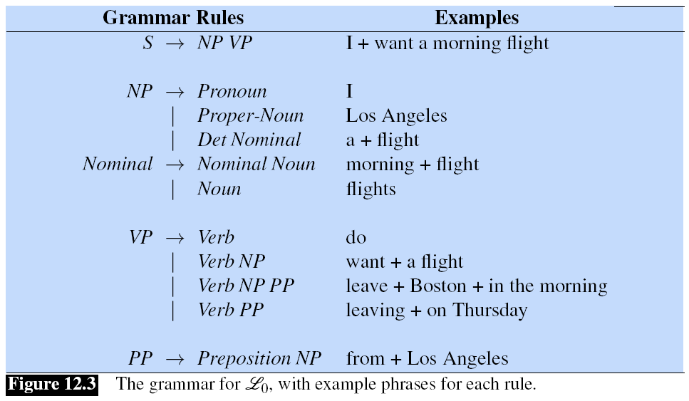
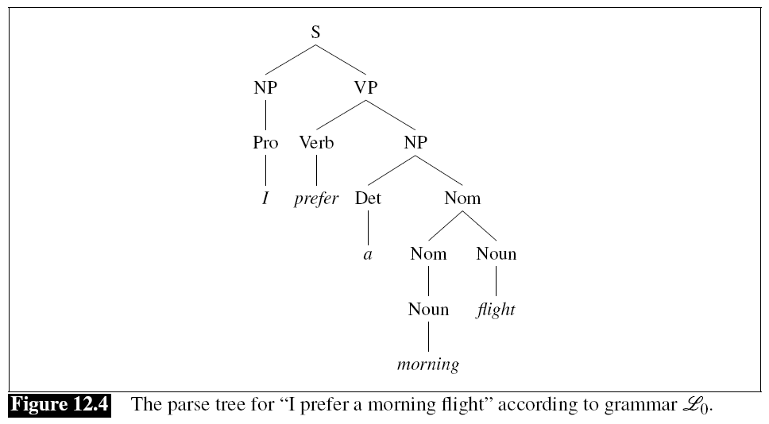

## 12.2 上下文无关文法（*Context-Free Grammars*）

在英语和其他自然语言中，最广泛使用的用于建模成分结构的形式系统（*formal system*）是**上下文无关文法**（*Context-Free Grammar*），即 **CFG**。上下文无关文法也被称为**短语结构文法**（*Phrase-Structure Grammars*），其形式上等同于**巴科斯-诺尔范式**（*Backus-Naur Form*），即 BNF。将文法建立在成分结构上的想法可以追溯到心理学家 Wilhelm Wundt (1900)[^1]，但直到 Chomsky (1956)[^2] 和 Backus (1959)[^3] 才被形式化。

上下文无关语法由一组**规则**（*rules*）或**产生式**（*productions*）组成，它们都表达了语言符号可以组合和排序在一起的方式，以及单词和符号的**词典**（*lexicon*）。例如，以下产生式表达了 **NP**（即**名词短语**（*noun phrase*））可以由*专有名词*（*ProperNoun*）或定语（*determiner*）（*Det*）组成，后面跟着一个*名词性词*（*Nominal*）；Nominal 反过来可以由一个或多个 Nouns 组成。[^4]

> *NP* $\rightarrow$ *Det Nominal*  
> *NP* $\rightarrow$ *ProperNoun*  
> *Nominal* $\rightarrow$ *Noun* | *Nominal Noun*  

上下文无关规则可以分层嵌入，所以我们可以把前面的规则和其他的规则结合起来，比如下面的规则，表达了关于词典的情况：

> *Det* $\rightarrow$ *a*  
> *Det* $\rightarrow$ *the*  
> *Noun* $\rightarrow$ *flight*  

CFG 中使用的符号被分为两类。与语言中的词（“the”、“nightclub”）相对应的符号被称为**终结符**（*terminal*）；词典（*lexicon*）是引入这些终结符的规则集。用于抽象表达这些终结符的符号被称为**非终结符**（*non-terminal*）。在上下文无关规则中，箭头（$\rightarrow$）右边的项目是一个或多个终结符和非终结符的有序列表；箭头左边是单个非终结符，表达某种聚类或概括。与词典中每个词相关的非终结符是它的词类或词性。

我们可以从两个方面来考虑 CFG：一个是视为生成句子的装置，一个是为给定句子分配结构的装置。当把 CFG 看作是一个生成器时，我们可以把 $\rightarrow$ 理解为“用右边的符号串重写左边的符号”。

|步骤|结果|
|---|---|
|从符号 *NP* 开始：|*NP*|
|我们可以根据第一条规则将其重写为：|*Det Nominal*|
|然后重写 *Nominal*：|*Det Noun*|
|最后重写词性：|*a flight*|

我们说可以从非终结符 *NP* 推导出字符串 *a flight* 。因此，CFG 可以用来生成一组字符串。这个规则扩展序列被称为词串的**推导**（*derivation*）。通常用一棵**分析树**（*parse tree*）来表示一个推导（通常是倒置显示，根在顶部）。图 12.1 显示了这种推导的树状表示。

在图 12.1 所示的分析树中，我们可以说节点 *NP* **支配着**（*dominates*）树上的所有节点（*Det*、*Nom*、*Noun*、*a*、*flight*）。我们可以进一步说，它直接支配了节点 *Det* 和 *Nom*。

CFG 所定义的形式语言是由指定的**起始符**（*start symbol*）所推导出来的字符串的集合。每个语法都必须有一个指定的起始符，通常称为 *S*。由于上下文无关文法经常被用来定义句子，所以 *S* 通常表示“sentence”节点，而从 *S* 推导出来的字符串集就是某个简化版英语中的句子集。

让我们再添加一些额外的规则。下面的规则表述了这样一个事实：一个句子可以由一个名词短语和一个**动词短语**（*verb phrase*）组成，其中动词短语跟在名词短语后面：

> S $\rightarrow$ NP VP  
> I prefer a morning flight

英语中的动词短语由一个动词和跟在其后的其他各种词组成。例如，有一种动词短语是由一个动词和一个名词短语组成：

> VP $\rightarrow$ Verb NP  
> prefer a morning flight

动词后跟的也可能是一个名词短语和一个介词短语：

> VP $\rightarrow$ Verb NP PP  
> leave Boston in the morning

或者动词后单独跟一个介词短语：

> VP $\rightarrow$ Verb PP  
> leaving on Thursday

介词短语一般是介词后跟着一个名词短语。例如，在 ATIS 语料库中，有一种常见的介词短语被用来表示位置或方向：

> PP $\rightarrow$ Preposition NP  
> from Los Angeles

PP 内的 NP 不一定是一个地点。PP 经常与时间和日期一起使用，也可以与其他名词一起使用，可能很简单也可能很复杂。下面是 ATIS 语料库中的十个 PP 例子：

> to Seattle  
> in Minneapolis  
> on Wednesday  
> in the evening  
> on the ninth of July  
> on these flights  
> about the ground transportation in Chicago  
> of the round trip flight on United Airlines  
> of the AP fifty seven flight  
> with a stopover in Nashville

图 12.2 给出了一个样本词典，图 12.3 总结了我们到目前为止所看到的语法规则，我们将其称为 $\mathscr{L}_0$。请注意，我们可以使用或符号 | 来表示一个非终结符有其他可选扩展。

我们可以用这个语法来生成“ATIS 语言”的句子。我们从 *S* 开始，将其扩展为 *NP VP*，然后随机扩展 *NP*（比如，扩展为 *I*），以及 VP（比如，扩展为 *Verb NP*），以此类推，直到我们生成 *I prefer a morning flight* 这个字符串。图 12.4 显示了一个分析树，它描述了 *I prefer a morning flight* 的完整推导过程。

我们也可以用一种更为紧凑的格式来表示分析树，称为**括弧标记法**（***bracketed notation***）。下面是图 12.4 的分析树对应的括弧表示：

$[_S \; [_{NP} \; [_{Pro} \; \text{I}]] \; [_{VP} \; [_V \; \text{prefer}] \; [_{NP} \; [_{Det} \; \text{a}] \; [_{Nom} \; [_N \; \text{morning}] \; [_{Nom} \; [_N \; \text{flight}]]]]]]$

像 $\mathscr{L_0}$ 这样的 CFG 定义了一种形式语言（*formal language*）。我们在第二章看到，形式语言是一组字符串。如果一个句子可以由该语法规则推导出来，那么这个句子就在由该语法规则所定义的形式语言中，并被称**符合语法的句子**（*grammatical sentences*）。反之，该句子则是**不符合语法的**（*ungrammatical*）。

这种“在”或“不在”的硬性界线是所有形式语言的特征，但这只是自然语言真正运作原理的一个非常简化的模型。这是因为确定一个给定的句子是否属于一个给定的自然语言（例如英语）往往要取决于上下文。在语言学中，使用形式语言的方式来建模自然语言被称为**生成文法**（*generative grammar*），因为语言是由该语法所“生成”的可能句子集所定义的。

### 12.2.1 上下文无关文法的形式定义

在这一节的最后，我们将快速、正式地描述一下上下文无关文法及其生成的语言。一个上下文无关文法 $G$ 是由四个参数定义的：$N$、$\Sigma$、$R$ 和 $S$（技术上来说这是一个“4元组”）。

|参数|意义|
|---|---|
|$N$|一个**非终结符**（或者叫**变量**）的集合|
|$\Sigma$|一个**终结符**的集合（与 $N$ 无交集）|
|$R$|一个**规则**或者**产生式**的集合，每个元素都是 $A \rightarrow \beta 的形式，其中 $A$ 是非终结符，$\beta$ 是无穷集 $(\Sigma \cup N)^*$ 的一个元素|
|$S$|一个指定的开始符，为 $N$ 的一个元素|

[^1]: Wundt,W. 1900. V¨olkerpsychologie: eine Untersuchung der Entwicklungsgesetze von Sprache, Mythus, und Sitte. W. Engelmann, Leipzig. Band II: Die Sprache, Zweiter Teil.
[^2]: Chomsky, N. 1956. Three models for the description of language. IRE Transactions on Information Theory, 2(3):113–124.
[^3]: Backus, J. W. 1959. The syntax and semantics of the proposed international algebraic language of the Zurich ACM-GAMM Conference. Information Processing: Proceedings of the International Conference on Information Processing, Paris. UNESCO.
[^4]: 在谈论这些规则时，我们可以将右箭头 $\rightarrow$ 读为“goes to”，因此我们可以将上面的第一条规则读为“NP goes to Det Nominal”。
