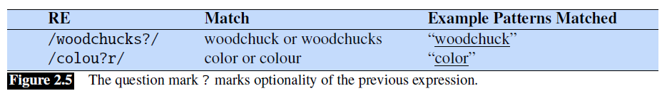

## 2.1 正则表达式

**正则表达式**（RE）是一种用于特定文本字符串搜索的语言，是在计算机科学领域标准化方面鲜为人知的成功之一。每种计算机语言、文字处理器和文本处理工具（例如 Unix 工具 `grep` 或 Emacs）都会使用这种实用语言。形式上，正则表达式是用于表征一组字符串的代数符号。当我们有一个搜索**模式**（pattern）和一个**语料库**要搜索时，它们此时就会非常有用。正则表达式的搜索函数将在这个语料库中进行搜索，返回所有符合模式的文本。语料库可以是单个文档，也可以是多个文档的集合。例如，Unix 命令行工具 `grep` 接受一个正则表达式，并返回输入文档中与该表达式匹配的每一行。

搜索函数可以被设计为返回一行中的所有匹配项（如果有多个匹配项），或者仅返回第一个匹配项。在下面的例子中，我们通常会在与正则表达式相匹配的字符串下面划下划线，并且只显示第一个匹配项。正则表达式用斜杠分隔，但请注意，斜杠不是正则表达式的一部分。

正则表达式有很多变体。我们将使用**扩展的正则表达式**（extended regular expressions）；不同的正则表达式解析器可能只能识别这些正则表达式的子集，或者对某些表达式的处理方式略有不同。在线正则表达式测试器可以很方便地测试你的表达式并探索这些变体。

### 2.1.1 基础正则表达式模式

最简单的正则表达式是一个简单的字符序列。要搜索 *woodchuck*，我们可以使用 `/woodchuck/`。正则表达式 `/Buttercup/` 会匹配到任何包含 `Buttercup` 的字符串；使用该表达式的 `grep` 将返回 *I'm called little Buttercup* 这一行。搜索字符串可以由单个字符组成（如 `/!/`），也可以由一系列字符组成（如 `/urgl/`）。


正则表达式是**区分大小写**的；小写的 `/s/` 与大写的 `/S/` 不同（`/s/` 匹配小写的 `s`，但不匹配大写的 `S`）。这就意味着模式 `/woodchucks/` 不会匹配到字符串 *Woodchucks*。我们可以利用方括号 `[]` 来解决这个问题。方括号内的字符之间是一个**逻辑或**的关系。例如，图 2.2 显示，模式 `/[wW]/` 既可以匹配到 *w* 也可以匹配到 *W*。


正则表达式 `/[1234567890]/` 表示匹配所有数字。虽然数字或字母这样的字符类别是表达式中的重要组成部分，但它们可能会变得很笨拙，例如，使用 `/[ABCDEFGHIJKLMNOPQRSTUVWXYZ]/` 来表示所有大写字母是很不方便的。

如果存在一组字符串，它们之间的序列关系是明确定义的，则可以将方括号与破折号（`-`）一起使用以指定**范围**（range）中的任何一个字符。模式 `/[2-5]/` 匹配字符*2*、*3*、*4* 或 *5* 中的任意一个。模式 `/[b-g]/` 指定字符 *b*、*c*、*d*、*e*、*f* 或 *g* 中的一个。其他一些例子如图 2.3 所示。


方括号也可以用来指定一个字符不能是什么：使用符号 `^`。如果 `^` 是左方括号 `[` 之后的第一个符号，则该模式取反。例如，模式 `/[^a]/`匹配除 *a* 之外的任何单个字符（包括特殊字符）。只有当 `^` 是左方括号后的第一个字符时，才表示取反。如果它出现在其他任何地方，通常就只是表示该符号本身。图 2.4 给出了一些示例。


那假如说我们想要某些字符是可选的呢？比如说 *woodchuck* 和 *woodchucks* 中的 *s*？我们不能使用方括号，因为方括号表示“s 或 S”，但不是“s 或者没有"。为此我们可以使用问号 `/?/`，它的意思是“前面的字符有或没有”，如图 2.5 所示。



我们可以认为问号的意思是“前一个字符出现 0 次或 1 次"。也就是说，它可以指定我们想要的字符有多少个，这一点在正则表达式中非常重要。例如，考虑由以下字符串组成的羊的语言：

```
baa!
baaa!
baaaa!
baaaaa!
...
```

这种语言由一个 *b* 开头，后跟至少两个 *a*，再加上感叹号。我们可以用星号 `*` 表示“某些数量的 *a*”，通常称之为 **Kleene `*`**（发音为“cleany star”）。`*` 表示“前一个字符或正则表达式出现 0 次或多次”。因此，`/a*/` 表示“出现 *a* 0 次或多次的任何字符串”。 这会匹配到 *a* 或 *aaaaaa*，但也会匹配到 *Off Minor*，因为 *a* 的出现次数为 0。因此，用于匹配一个或多个 *a* 的正则表达式为 `/aa*/`，表示一个 *a* 后跟 0 个或多个 *a*。同理也可以重复构造更复杂的表达式。因此， `/[ab]*/` 的意思就是“0 个或多个 *a* 或 *b*”（不是“0 个或多个右方括号”），这会匹配到 *aaaa* 或 *ababab* 或 *bbbb* 之类的字符串。
