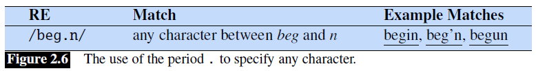
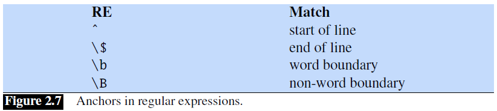
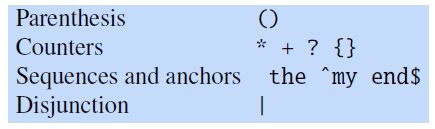
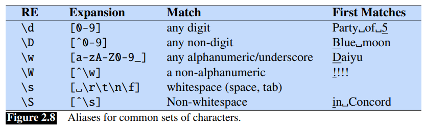
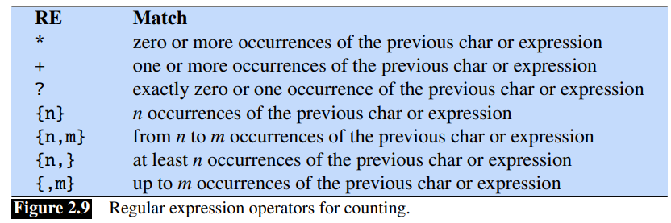
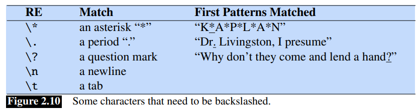

## 2.1 正则表达式

**正则表达式**（*RE*）是一种用于特定文本字符串搜索的语言，是在计算机科学领域标准化方面鲜为人知的成功之一。每种计算机语言、文字处理器和文本处理工具（例如 Unix 工具 `grep` 或 Emacs）都会使用这种实用语言。形式上，正则表达式是用于表征一组字符串的代数符号。当我们有一个搜索**模式**（*pattern*）和一个**语料库**要搜索时，它们此时就会非常有用。正则表达式的搜索函数将在这个语料库中进行搜索，返回所有符合模式的文本。语料库可以是单个文档，也可以是多个文档的集合。例如，Unix 命令行工具 `grep` 接受一个正则表达式，并返回输入文档中与该表达式匹配的每一行。

搜索函数可以被设计为返回一行中的所有匹配项（如果有多个匹配项），或者仅返回第一个匹配项。在下面的例子中，我们通常会在与正则表达式相匹配的字符串下面划下划线，并且只显示第一个匹配项。正则表达式用斜杠分隔，但请注意，斜杠不是正则表达式的一部分。

正则表达式有很多变体。我们将使用**扩展的正则表达式**（*extended regular expressions*）；不同的正则表达式解析器可能只能识别这些正则表达式的子集，或者对某些表达式的处理方式略有不同。在线正则表达式测试器可以很方便地测试你的表达式并探索这些变体。

### 2.1.1 基础正则表达式模式

最简单的正则表达式是一个简单的字符序列。要搜索 *woodchuck*，我们可以使用 `/woodchuck/`。正则表达式 `/Buttercup/` 会匹配到任何包含 `Buttercup` 的字符串；使用该表达式的 `grep` 将返回 *I'm called little Buttercup* 这一行。搜索字符串可以由单个字符组成（如 `/!/`），也可以由一系列字符组成（如 `/urgl/`）。


正则表达式是**区分大小写**的；小写的 `/s/` 与大写的 `/S/` 不同（`/s/` 匹配小写的 `s`，但不匹配大写的 `S`）。这就意味着模式 `/woodchucks/` 不会匹配到字符串 *Woodchucks*。我们可以利用方括号 `[]` 来解决这个问题。方括号内的字符之间是一个**逻辑或**的关系。例如，图 2.2 显示，模式 `/[wW]/` 既可以匹配到 *w* 也可以匹配到 *W*。


正则表达式 `/[1234567890]/` 表示匹配所有数字。虽然数字或字母这样的字符类别是表达式中的重要组成部分，但它们可能会变得很笨拙，例如，使用 `/[ABCDEFGHIJKLMNOPQRSTUVWXYZ]/` 来表示所有大写字母是很不方便的。

如果存在一组字符串，它们之间的序列关系是明确定义的，则可以将方括号与破折号（`-`）一起使用以指定**范围**（*range*）中的任何一个字符。模式 `/[2-5]/` 匹配字符*2*、*3*、*4* 或 *5* 中的任意一个。模式 `/[b-g]/` 指定字符 *b*、*c*、*d*、*e*、*f* 或 *g* 中的一个。其他一些例子如图 2.3 所示。


方括号也可以用来指定一个字符不能是什么：使用插入符 `^`。如果 `^` 是左方括号 `[` 之后的第一个符号，则该模式取反。例如，模式 `/[^a]/`匹配除 *a* 之外的任何单个字符（包括特殊字符）。只有当 `^` 是左方括号后的第一个字符时，才表示取反。如果它出现在其他任何地方，通常就只是表示该符号本身。图 2.4 给出了一些示例。


那假如说我们想要某些字符是可选的呢？比如说 *woodchuck* 和 *woodchucks* 中的 *s*？我们不能使用方括号，因为方括号表示“s 或 S”，但不是“s 或者没有"。为此我们可以使用问号 `/?/`，它的意思是“前面的字符有或没有”，如图 2.5 所示。


我们可以认为问号的意思是“前一个字符出现 0 次或 1 次"。也就是说，它可以指定我们想要的字符有多少个，这一点在正则表达式中非常重要。例如，考虑由以下字符串组成的羊的语言：

```
baa!
baaa!
baaaa!
baaaaa!
...
```

这种语言由一个 *b* 开头，后跟至少两个 *a*，再加上感叹号。我们可以用星号 `*` 表示“某些数量的 *a*”，通常称之为 **Kleene `*`**（发音为“cleany star”）。`*` 表示“前一个字符或正则表达式出现 0 次或多次”。因此，`/a*/` 表示“出现 *a* 0 次或多次的任何字符串”。 这会匹配到 *a* 或 *aaaaaa*，但也会匹配到 *Off Minor*，因为 *a* 的出现次数为 0。因此，用于匹配一个或多个 *a* 的正则表达式为 `/aa*/`，表示一个 *a* 后跟 0 个或多个 *a*。同理也可以重复构造更复杂的表达式。因此， `/[ab]*/` 的意思就是“0 个或多个 *a* 或 *b*”（不是“0 个或多个右方括号”），这会匹配到 *aaaa* 或 *ababab* 或 *bbbb* 之类的字符串。

我们可以扩展表示单个数字的正则表达式 `/[0-9]/`，来匹配多个数字（对于查找价格很有用）：`/[0-9][0-9]*/`。(为什么不只是 `/[0-9]*/` 呢？)

要把匹配单个数字的正则表达式写两遍是很烦人的，所以我们有一个更方便的方法来匹配“至少一个”某个字符。这就是 **Kleene `+`**，意思是“前面的字符或正则表达式出现 1 次或多次”。因此，我们一般使用 `/[0-9]+/` 来表示“一串数字”。所以，就有两种方式来匹配上述羊语：`/baaa*!/` 或 `/baa+!/`。

一个非常重要的特殊字符是句号（`/./`），一个通配符，可以匹配任何单个字符（回车（*carriage return*）除外），如图 2.6 所示。



通配符经常和星号一起使用，表示“任何字符串”。例如，假设我们想找那些 *ardvark* 出现两次的行，就可以用正则表达式 `/aardvark.*aardvark/`。

锚点（*译者注：anchors，或者叫定位符*）是将正则表达式锚定在字符串中特定位置的特殊字符，即表示位置。最常见的锚点是插入符（*caret*）`^` 和美元符号 `$`。`^` 匹配某行的开始。`/^The/` 仅匹配那些以 *The* 开头的行。因此，`^` 就有三种用途：匹配行首，在方括号内表示否定，以及仅仅表示该符号。（有哪些上下文可以让 grep 或 Python 知道一个特定的 `^` 表示什么用途？）美元符号 `$` 匹配行尾。所以，` $`（`$` 前有一个空格）就表示匹配行末的空格，而 `/^The dog\.$/` 匹配只包含 `The dog.` 的行。（我们必须在这里使用反斜杠，因为我们希望 `.` 表示“句号”，而不是通配符。）



另外还有两个锚点。`\b` 匹配一个词的边界，`\B` 匹配非边界。因此，`/\bthe\b/` 匹配的是单词 *the*，而不是单词 *other*。从技术上讲，正则表达式中所说的“词”，是指任何由数字、下划线或字母构成的序列；这种定义是基于编程语言中“词”（*译者注：标识符*）的定义的。例如，`/\b99\b/` 将会匹配到 *There are 99 bottles of beer on the wall* 中的 *99*（因为 99 前面是空格），但不会匹配到 *There are 299 bottles of beer on the wall*（因为 99 前面是数字）。但会匹配到 `$99` 中的 *99*（因为 *99* 前面跟着一个美元符号 `$`，而不是数字、下划线或字母）。（*译者注：99 前面跟着 `$`，而 `$` 不属于词的构成元素，所以被视为边界 boundary，所以才会匹配到 `$99`，同样也会匹配到 `^99`。所以特别注意，**并不是空格才会被视为边界**。*）

### 2.1.2 逻辑或，组合和优先级

假设我们需要搜索关于宠物的文本；也许我们对猫和狗特别感兴趣。在这种情况下，我们可能要搜索字符串 *cat* 或 *dog*。我们自然不能使用方括号来表示“cat or dog”（为什么不能写成 `/[catdog]/` ？)，所以我们需要一个新的运算符：**逻辑或**运算符（*disjunction operator*），也叫**管道**（*pipe*）符号 `|`。`/cat|dog/` 就可以匹配字符串 *cat* 或 *dog* 了。

有时候，我们需要在一个较大的序列中使用这个逻辑或运算符。例如，我想帮我的表哥 David 搜索关于宠物鱼的信息，如何才能同时匹配 *guppy* 和 *guppies* ？我们不能简单地写成 `/guppy|ies/`，因为这样就只能匹配到 *guppy* 和 *ies* 这两个字符串。这是因为像 `guppy` 这样的序列的**优先级**（*precedence*）高于 `|`（*译者注：按照从左到右的顺序*）。要使 `|` 仅作用于一个特定的模式或范围，我们需要使用括号运算符 `(` 和 `)`。用括号括住的模式，可以使它像单个字符一样作用于相邻运算符如 `|` 和 `*`。 因此，模式 `/gupp(y|ies)/` 将表示 `|` 只作用于后缀 *y* 和 *ies*。

括号运算符 `(` 在我们使用像 `*` 这样的计数器时也很有用。与 `|` 不同，默认情况下，`*` 仅适用于其前紧邻的单个字符，而不适用于整个序列。假设我们要匹配重复项。假如我们有一行文本，行标签的格式为 *Column 1 Column 2 Column3*。那么表达式 `/Column [0-9] + */` 将不匹配到任何 column；相反，它匹配的是 Column 后跟任意数量空格的字符串！这里的 `*` 仅适用于其前面的空格，而不适用于其前面整个序列。有了括号，我们就可以使用 `/(Column [0-9]+ *)*/` 来匹配单词 *Column*，后面再加上一个数字和可选的空格，整个模式重复 0 次或多次。

一个运算符可能优先于另一个运算符，这就要求我们有时要用括号来表达我们的意图，这种做法是通过**运算符优先级**（*operator precedence hierarchy*）来实现的。下表给出了正则表达式中运算符优先级的顺序，从最高优先级到最低优先级。



因此，由于 counters 比 sequences 具有更高的优先级，所以 `/the*/` 会匹配到 *theeeee* 而不是 *thethe*。由于 sequences 的优先级高于 disjunction，所以 `/the|any/` 会匹配到 *the* 或者 *any*，但不会匹配到 *thany* 或 *theny*。

一些表达式可能比较含糊不清。考虑在 *once upon a time* 上应用表达式 `/[a-z]*/`。由于 `/[a-z]*/` 匹配 0 个或更多字母，所以这个表达式可能什么都匹配不到，或者只匹配第一个字母 *o*、*on*、*onc* 或 *once*。在这些情况下，正则表达式总是尝试匹配最长的字符串，此时我们就说这种表达式是**贪婪的**（*greedy*），会尽可能多的覆盖一个字符串。

但是，有一些方法是可以强制执行非贪婪匹配的，比如使用另一种含义的 `?` 。`*?` 和 `+?` 都表示尽可能少地匹配文本。

> 译者注：在 Python 中，在 *once upon a time* 上应用 `/[a-z]*/` 等表达式的结果如下：
> ```python
> >>> re.findall(r'[a-z]*', 'once upon a time')
> ['once', '', 'upon', '', 'a', '', 'time', '']  # 注意中间不是空格，下同
> >>> re.findall(r'[a-z]*?', 'once upon a time')
> ['', 'o', '', 'n', '', 'c', '', 'e', '', '', 'u', '', 'p', '', 'o', '', 'n', '', '', 'a', '', '', 't', '', 'i', '', 'm', '', 'e', '']
> >>> re.findall(r'[a-z]+', 'once upon a time')
> ['once', 'upon', 'a', 'time']
> >>> re.findall(r'[a-z]+?', 'once upon a time')
> ['o', 'n', 'c', 'e', 'u', 'p', 'o', 'n', 'a', 't', 'i', 'm', 'e']
> ```

### 2.1.3 一个简单的例子

假设我们想写一个 RE 来寻找英文文章中的 *the*。一个简单（但不正确）的模式可能是：

```
/the/
```

这个模式存在的一个问题是，当这个词位于句首并首字母大写时，这种模式就会匹配失败。所以我们可以使用以下模式：

```
/[tT]he/
```

但我们仍然会错误地返回嵌入在其他单词中的文本（例如，*other* 或 *theology*）。所以我们需要指定词的边界：

```
/\b[tT]he\b/
```

假设我们不想使用 `/\b/`，因为 `/\b/` 不会将下划线和数字视为词的边界；但我们可能希望也要匹配到含有下划线或数字的单词（*the_* 或 *the25*）。所以我们需要指定在 *the* 两边没有字母：

```
/[^a-zA-Z][tT]he[^a-zA-Z]/
```

但这种模式还有一个问题：当 *the* 在行首时，仍然会匹配失败。这是因为正则表达式 `[^a-zA-Z]` 意味着在 *the* 之前必须有单一的字符（虽然不是字母）。我们可以指定以 *the* 开头或其前面有一个非字母的字符，行尾同理：

```
/(^|[^a-zA-Z])[tT]he([^a-zA-Z]|$)/
```

我们刚刚经历的过程实际上是在修复两种错误：**假阳性**（*false positives*），即我们匹配了一些错误的字符串，如 *other* 或 *there*；**假阴性**（*false negatives*），即我们漏掉了一些字符串，如 *The*。在实现语音和语言处理系统的过程中，我们会反复解决这两种错误。因此，降低应用程序的总体错误率涉及到两个相互对立（*antagonistic*）的努力：

- 提高**查准率**（*precision*）（最大限度地减少假阳性）。
- 提高**召回率**（*recall*）（最大限度地减少假阴性）。

我们将在第四章中用更精确的定义再来讨论 precision 和 recall。

### 2.1.4 更多的运算符

图 2.8 列出了一些常用范围的别名，这些别名更为简洁。除了 `*` 和 `+`，我们还可以通过大括号显式地使用数字作为计数器。正则表达式 `/{3}/` 表示“前一个字符或表达式正好出现3次”。因此，`/a\.{24}z/` 将匹配 *a* 后面跟着 24 个点，再跟着一个 *z*（但不是 *a* 后面跟着 23 或 25 个点）。



大括号也可以用来指定一个数字范围。因此，`/{n,m}/` 表示前一个字符或表达式的出现 *n* 到 *m* 次数，而 `/{n,}/` 则表示前一个表达式至少出现 *n* 次。图 2.9 总结了用于计数的 RE。



最后，某些特殊字符需要使用反斜杠进行转义以表达其本身（见图 2.10）。其中最常见的是**换行符** `\n` 和**制表符** `\t`。对于那些本身就很特殊的字符（如 `.`、`*`、`[` 和 `\`），需要在它们前面加上反斜线，（即 `/\./`、`/\*/`、`/\[/` 和 `/\\/`）。



### 2.1.5 一个更复杂的例子

让我们来尝试一个更复杂的例子来说明 RE 的强大。假设我们想建立一个应用程序来帮助用户在网络上购买一台计算机，用户可能想要“any machine with at least 6 GHz and 500 GB of disk space for less than $1000”。为了进行这种搜索，我们首先需要能够寻找 *6 GHz* 或 *500 GB* 或 *Mac* 或 *$999.99* 这样的表达式。在本节的剩余部分，我们将为这个任务编写出一些简单的正则表达式。

首先，让我们完成用于价格匹配的正则表达式。下面是一个常见的用于匹配美元符号和一串数字的正则表达式：

```
/$[0-9]+/
```

请注意，这里的 `$` 并不表示我们前面讨论的行尾匹配功能。大多数正则表达式解析器都很聪明，能够意识到这里的 `$` 并不意味着行尾匹配。(作为一个思考实验，思考一下正则表达式解析器如何从上下文获知 `$` 的功能。)

> 译者注：大多数情况下，最好还是转义一下 `$`，有些解析器并不能如上所说的依靠上下文获知其功能，例如下面这个 Python 例子：
> ```python
> >>> for match in re.finditer(r'$[0-9]+', 'less than $1000'):
> >>>     print(match)
> # 此时不会有任何输出，因为 re 仍然将 $ 当作了行尾匹配符号。
> # 下面我们加上转义
> >>> for match in re.finditer(r'\$[0-9]+', 'less than $1000'):
> >>>     print(match)
> <re.Match object; span=(10, 15), match='$1000'>
> # 此时就能正确匹配了。
> ```
> 在线正则表达式测试网站 regex101.com 结果和上述 Python 例子相同。显式加上转义，不仅可以让结果更加稳定，还可以提升程序可读性。下面的表达式同理，不再赘述。

现在我们只需要处理价格的小数部分。我们会在后面加上一个小数点和两个数字：

```
/$[0-9]+\.[0-9][0-9]/
```

这个模式会匹配到 *$199.99*，但不会匹配到 *$199*。我们需要将分币作为可选项，并确定边界：

```
/(^|\W)$[0-9]+(\.[0-9][0-9])?\b/
```

最后一个问题! 这种模式会匹配到如 *$199999.99* 这样的价格，这就太贵了! 我们需要限制价格：

```
/(^|\W)$[0-9]{0,3}(\.[0-9][0-9])?\b/
```

那磁盘空间呢？我们需要再次允许使用可选的小数（*5.5 GB*）；注意使用 `?` 来使最后的 `s` 成为可选的，使用 `/ */` 表示“ 0 个或更多的空格”，因为可能总是有额外的空格：

```
/\b[0-9]+(\.[0-9]+)? *(GB|[Gg]igabytes?)\b/
```

修改这个正则表达式，使其只匹配 500 GB 以上，就留给读者作为练习吧。

### 2.1.6 替换，捕获组（*Capture Groups*）和 ELIZA

正则表达式的一个重要用途是**替换**（*substitutions*）。例如，在 Python 和 Unix 命令（如 `vim` 或 `sed`）中使用的替换运算符 `s/regexp1/pattern/`，可用另一个字符串替换一个由正则表达式表示的字符串：

```
s/colour/color/
```

通常我们需要引用与第一种模式相匹配的字符串的特定字串。例如，假设我们想在文本中的所有整数周围加上尖括号，例如，将 *the 35 boxes* 改为 *the <35> boxes*。我们希望有一种方法来引用我们找到的整数，这样我们就可以很容易地添加括号。要做到这一点，我们可以在第一个模式周围加上括号 `(` 和 `)`，并在第二个模式中使用**数字**（*number*）运算符 `\1` 来引用：

```
s/([0-9]+)/<\1>/
```

> 译者注：Python 中，正则替换需要使用 [`re.sub`](https://docs.python.org/3/library/re.html#re.sub)，且 `\1` 还可以写为 `\g<1>`：
> ```python
> >>> re.sub(r'([0-9]+)', r'<\g<1>>', 'the 35 boxes')
> 'the <35> boxes'
> >>> re.sub(r'([0-9]+)', r'<\1>', 'the 35 boxes')
> 'the <35> boxes'
> ```

括号和数字运算符也可以指定某个字符串或表达式必须在文本中出现两次。例如，假设我们正在寻找“the Xer they were, the Xer they will be”的模式，我们想限制两个 X 必须是同一个字符串。我们可以在第一个 X 周围加上括号，并用数字运算符 `\1` 来指代第二个 X，如下所示：

```
/the (.*)er they were, the \1er they will be/
```

这里的 `\1` 将被前面括号中所匹配的字符串所取代。所以，这会匹配到 *the bigger they were, the bigger they will be*，而不会匹配到 *the bigger they were, the faster they will be*。

这种使用小括号在内存中存储模式的方式称为一个捕获组（*capture group*）。每次使用一个捕获组（即用小括号括住一个模式），所产生的匹配结果都会被存储在一个编号的寄存器（*register*）中。如果你使用了两组不同的小括号，那么 `\2` *第二个*捕获组所匹配的字符串。因此

```
/the (.*)er they (.*), the \1er we \2/
```

会匹配到 *the faster they ran, the faster we ran*，但不会匹配到 *the faster they ran, the faster we ate*。同样，第三个捕获组存储在 `\3`，第四个是 `\4`，以此类推。

因此，小括号在正则表达式中具有双重功能；它们可用于分组，以指定运算符的执行顺序。它们还可用于捕获内容以放到寄存器中。但有时我们可能想使用括号进行分组，但又不想存储到寄存器中。在这种情况下，我们可以使用一个**非捕获组**（*non-capturing group*），把命令 `?:` 放在左括号后，形式是 `(?: pattern )`。

```
/(?:some|a few) (people|cats) like some \1/
```

将会匹配到 *some cats like some cats*，但不会匹配到 *some cats like some a few*。（*译者注：`\1` 指的是 `(people|cats)`*）

在实现像 ELIZA 这样的简单聊天机器人时，替换和捕获组是非常有用的（Weizenbaum，1966）[^1]。回想一下，ELIZA 通过进行以下这样的对话来模拟一个使用当事人中心治疗法的治疗师（*Rogerian psychologist*）：

> User 1: Men are all alike.
> ELIZA 1： IN WHAT WAY
> User 2: They’re always bugging us about something or other.
> ELIZA 2：CAN YOU THINK OF A SPECIFIC EXAMPLE
> User3: Well, my boyfriend made me come here.
> ELIZA 3：YOUR BOYFRIEND MADE YOU COME HERE
> User 4: He says I’m depressed much of the time.
> ELIZA 4：I AM SORRY TO HEAR YOU ARE DEPRESSED

ELIZA 的工作原理是一系列的正则表达式替换，每一个替换都会匹配并改变输入的某些部分。输入行首先是大写的。输入首先会被替换成大写形式。第一组替换将所有的 *MY* 改为 *YOUR*，*I'M* 改为 *YOU ARE*，以此类推。下一组替换会匹配并替换输入中的其他模式。下面是一些例子：

```
s/.* I’M (depressed|sad) .*/I AM SORRY TO HEAR YOU ARE \1/
s/.* I AM (depressed|sad) .*/WHY DO YOU THINK YOU ARE \1/
s/.* all .*/IN WHAT WAY/
s/.* always .*/CAN YOU THINK OF A SPECIFIC EXAMPLE/
```

由于可以在给定输入上执行多个替换操作，所以替换会被分配为多个等级并按顺序执行。Exercise 2.3 是一个创建模式的练习，我们将在第 24 章讲述 ELIZA 架构的细节。

2.1.7 先行断言（*Lookahead Assertions*）

[^1]: Weizenbaum, J. (1966). ELIZA – A computer program for the study of natural language communication between man and machine. CACM 9(1), 36–45.
