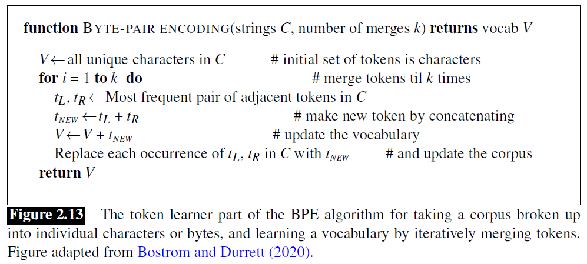

## 2.4 文本规范化（*Text Normalization*）

几乎在对文本进行任何自然语言处理之前，都必须对其进行规范化。作为任何规范化的一部分，通常至少有三项任务：

1. 分词（*Tokenizing (segmenting) words*）
2. 词格式（*word formats*）规范化
3. 分句

在接下来的章节中，我们将逐一讲解这些任务。

### 2.4.1 用于粗略分词和规范化的 Unix 工具

让我们从一个简单、有点幼稚的针对英语的分词和规范化（和频率计算）版本开始，该版本受到 Church(1994)[^1] 启发，可以只使用一个 UNIX 命令完成。我们将使用一些 Unix 命令：`tr`，用于改变输入中的特定字符；`sort`，按字母顺序对输入行进行排序；`uniq`，统计（*collapse and count*）文本文件中相邻且相同的行。

例如，让我们从一个包含 Shakespeare “完整单词”（*complete words*）的文本文件 `sh.txt` 开始（*译者注：应该是指 Shakespeare 所有作品文本都放在一行，然后该行放入 `sh.txt` 中*）。我们可以使用 `tr` 将每个非字母字符序列改为换行来进行分词（“A-Za-z”表示字母，`-c` 选项表示反选，即非字母，`-s` 选项将所有重复序列压缩为一个字符）：

```bash
tr -sc 'A-Za-z' '\n' < sh.txt
```

该命令的输出如下：

```
THE
SONNETS
by
William
Shakespeare
From
fairest
creatures
We
...
```

现在每行只有一个单词，我们可以对这些行进行排序，并将结果传递给 `uniq -c` 进行统计（*译者注：每列旁边显示该行重复出现的次数*）：

```bash
tr -sc 'A-Za-z' '\n' < sh.txt | sort | uniq -c
```

命令输出如下：

```
1945 A
72 AARON
19 ABBESS
25 Aaron
6 Abate
1 Abates
5 Abbess
6 Abbey
3 Abbot
...
```

另外，我们也可以先把所有的大写字母转成小写字母：

```bash
tr -sc 'A-Za-z' '\n' < sh.txt | tr A-Z a-z | sort | uniq -c
```

命令输出为：

```
14725 a
97 aaron
1 abaissiez
10 abandon
2 abandoned
2 abase
1 abash
14 abate
3 abated
3 abatement
...
```

现在我们可以再进行排序，找到经常出现的词。`sort` 的 `-n` 选项意味着按数字而不是按字母排序，而 `-r` 选项意味着按相反的顺序排序（从高到低）：

```bash
tr -sc 'A-Za-z' '\n' < sh.txt | tr A-Z a-z | sort | uniq -c | sort -n -r
```

结果表明，与其他语料库一样，Shakespeare 中出现频率最高的词是冠词（*articles*）、代词（*pronouns*）和介词（*prepositions*）等短**虚词**（*function words*）：

```
27378 the
26084 and
22538 i
19771 to
17481 of
14725 a
13826 you
12489 my
11318 that
11112 in
...
```

这类 Unix 工具在为任何语料库快速建立字数统计时都非常方便。

### 2.4.2 分词（*Word Tokenization*）

以上简单的 UNIX 工具对于获得粗略的单词统计是没有问题的，但是对于分词，也就是将文本分割成一个个词的任务，一般需要更复杂的分词算法。

Unix 命令过滤了所有的数字和标点符号，但对于大多数 NLP 应用来说，我们需要在分词任务中保留这些字符。我们往往想把标点符号视作一个单独词；对于解析器来说，逗号是一个有用的信息。句号有助于指示句子的边界。但我们有时会想保留词内部的标点符号，例如 *m.p.h*、*Ph.D.*、*AT&T* 和 *cap'n*。价格（$45.55）和日期（`01/02/06`）中的特殊字符和数字也需要保留；我们不想把这个价格分成“45”和“55”。还有网址（`http://www.stanford.edu`）、推特标签（`#nlproc`）和电子邮件地址（`someone@cs.colorado.edu`）。

数字也会带来其他复杂的问题；逗号通常是单词的边界，但在英语中，逗号也会用在数字内部，每三位数有一个逗号：`555,500.50`。不同语言对分词的要求也不一样，许多欧洲大陆的语言，如西班牙语、法语和德语，则用逗号来标记小数点，英语放逗号的地方则用空格（有时也用句号），例如：`555 500,50`。

分词器也可以用来扩展以撇号（*apostrophes*）标记的**附着语素**（*clitic*），例如，将 `what're` 转换为 `what are`，`we're` 转换为 `we are`。附着语素是一个词的一部分，它不能独立存在，只有在与另一个词相连时才会出现。一些这样的缩略语也会出现在其他字母语言（*alphabetic languages*）中，包括法语中的冠词和代词（`j'ai`，`l'homme`）。

根据应用不同，分词算法还可以将多词表达（如 `New York` 和 `rock 'n' roll`）分为一个单一的词，这需要某种多词表达字典。因此，分词与**命名实体识别**（*named entity recognition*）紧密相连，即检测名字、日期和组织的任务（第 8 章）。

一个常用的分词标准是 Penn Treebank 分词（*Penn Treebank tokenization*）标准，用于语言数据联盟（*Linguistic Data Consortium*）（LDC）发布的解析语料库（treebanks），它是许多有用数据集的来源。该标准会分离出附着语素（*doesn’t* 变成 *does* 加 *n’t*），保持连字符词在一起，并分离出所有标点符号（为了节省空间，我们在标记之间加入可见空格‘␣’，尽管换行更常见）：

> **输入**："The San Francisco-based restaurant," they said, "doesn't charge $10".  
> **输出**："␣The␣San␣Francisco-based␣restaurant␣,␣"␣they␣said␣,␣"␣does␣n't␣charge␣$␣10␣"␣.

在实践中，由于分词需要在其他自然语言处理任务之前进行，所以它必须非常快。因此，分词的标准方法是使用基于正则表达式的确定性算法，这些正则表达式被编译成非常高效的有限状态自动机（*finite state automata*）。例如，图 2.12 显示了一个使用基本正则表达式进行分词的例子，使用基于 Python 的自然语言工具包（*Natural Language Toolkit*）（NLTK）的 `ntrk.regexp_tokenize` 函数（Bird et al. 2009[^2]; http://www.nltk.org）。


精心设计的确定性算法可以处理歧义问题，例如，当把撇号用作属格标记（*genitive marker*）（如 *the book’s cover*），引用标记如 *‘The other class’, she said* 中的引号，或者像 *they’re* 这样用在附着语素中，撇号都需要进行不同的分词处理。

在书面汉语、日语和泰语等语言中，分词更为复杂，因为这些语言不使用空格来标记潜在的词的边界。例如，在中文中，词（*words*）是由汉字（*characters*）组成的（中文称为“**hanzi**”）。每个汉字一般代表一个语义单位（称为语素（*morpheme*）），并可读作一个音节。词的平均长度约为 2.4 个汉字。但在汉语中，决定什么算作一个词是很复杂的。例如，考虑以下句子：

> (2.4) 姚明进入总决赛  
> “Yao Ming reaches the finals”

如 Chen et al. (2017)[^9] 指出，可将其视为 3 个词（‘Chinese Treebank’ 分割）：

> (2.5) 姚明 进入 总决赛  
> YaoMing reaches finals

或者视为 5 个词（‘Peking University’ 分割）：

> (2.6) 姚 明 进入 总 决赛  
> Yao Ming reaches overall finals

最后，在汉语中可以干脆完全不考虑词，以汉字为基本元素，把句子当作一连串的 7 个字：

> (2.7) 姚 明 进 入 总 决 赛  
> Yao Ming enter enter overall decision game

事实上，对于大多数中文 NLP 任务来说，事实证明采取字而不是词作为输入效果更好，因为对于大多数应用来说，字已经包含了足够的语义，而且相比之下，大多数使用词作为输入的方法会导致巨大的词汇表，该表会包含大量非常罕见的词（Li et al., 2019[^3]）。

然而，对于日语和泰语来说，字的单位太小，因此需要使用**分词**（*word segmentation*）算法。在极少的情况下，这些算法对中文的分词也很有用，因为在这种情况下，需要的是词的边界而不是字的边界。这些语言的标准分词算法是使用有监督机器学习训练的神经**序列模型**（*sequence models*），在人工标注的训练集上进行训练；我们将在第 8 章和第 9 章介绍序列模型。

### 2.4.3 用于分词的字节对编码（*Byte-Pair Encoding for Tokenization*）

我们还有第三种分词方法。既不是将 token 定义为词（无论是用空格或更复杂的算法来分隔），也不是定义为字符（例如在中文任务中），我们可以让数据自动告诉我们应该将什么定义为 token。这在处理未登录词（*unknown words*）时特别有用，这在 NLP 中是一个很重要的问题。正如我们将在下一章看到的那样，NLP 算法通常会从一个语料库（训练语料库）进行学习，从中提取一些关于语言的事实，然后利用这些事实对另外一个测试语料库进行推理。因此，假设我们的训练语料库中包含，比如说 *low*、*new*、*newer* 等词，但不包含 *lower*，那么如果在测试语料库中出现了 *lower* 这个词，我们的系统就不知道该怎么处理它了。

为了处理这种未登录词的问题，现代分词器通常会自动推导出包括比词（*words*）更小的 token 集，称为**子词**（*subwords*）。子词可以是任意的子串，也可以是有语义的单位如 *-est* 或 *-er* 这种语素。语素是语言中最小的语义单位，例如 *unlikeliest* 这个词就有语素 *un-*、*likely* 和 *-est*。在现代分词方案中，大多数 token 是词，但有些 token 是经常出现的语素或其他子词，如 *-er*。因此，每一个未登录词，如 *lower*，都可以用一些已知的子词来表示，如 *low* 和 *er*，必要时甚至可以用单个字母序列来表示。

大多数分词方案有两个部分：一个 token 学习器（*token learner*）和一个 token 分割器（*token segmenter*）。Token 学习器使用原始训练语料库（有时会预先进行粗略分词，如使用空格），然后得到一个词汇表（*vocabulary*），一个 token 集合。Token 分割器将一个原始测试句子分割成词汇表中的 token。有三种广泛使用的算法：**字节对编码**（*byte-pair encoding*）（Sennrich et al., 2016[^4]）、**一元语法语言模型**（*unigram language modeling*）（Kudo, 2018）和 **WordPiece**（Schuster and Nakajima, 2012[^6]）；还有一个 **SentencePiece** 库，包含了这三种算法中前两种的实现（Kudo and Richardson, 2018[^7]）。

在本节中，我们将介绍三种算法中最简单的一种，即**字节对编码**或 **BPE** 算法（Sennrich et al., 2016[^4]），见图 2.13。BPE 的 token 学习器从一个初始词汇表开始，这个词汇表只是所有单个字符（*characters*）的集合。然后它遍历训练语料库，选择两个最常相邻的符号（*symbol*）（比如说 ‘A’、‘B’），将两者合并成一个新的符号‘AB’添加到词汇表中，并将语料库中每一个相邻的‘A’‘B’替换为新的‘AB’。以此循环往复，得到新的越来越长的字符串，直到完成了 $k$ 次合并，创造了 $k$ 个新的符号；因此 $k$ 是算法的一个参数。最终产生的词汇表由原来的字符集加上 $k$ 个新的符号组成。



[^1]: Church, K. W. (1994). Unix for Poets. Slides from 2nd ELSNET Summer School and unpublished paper ms.  
[^2]: Bird, S., Klein, E., and Loper, E. (2009). Natural Language Processing with Python. O’Reilly.  
[^3]: Li, X., Meng, Y., Sun, X., Han, Q., Yuan, A., and Li, J. (2019). Is word segmentation necessary for deep learning of Chinese representations?. ACL.  
[^4]: Sennrich, R., Haddow, B., and Birch, A. (2016). Neural machine translation of rare words with subword units. ACL.  
[^5]: Kudo, T. (2018). Subword regularization: Improving neural network translation models with multiple subword candidates. ACL.
[^6]: Schuster, M. and Nakajima, K. (2012). Japanese and korean voice search. ICASSP.  
[^7]: Kudo, T. and Richardson, J. (2018). SentencePiece: A simple and language independent subword tokenizer and detokenizer for neural text processing. EMNLP.
[^8]: Bostrom, K. and Durrett, G. (2020). Byte pair encoding is suboptimal for language model pretraining. arXiv.  
[^9]: Chen, X., Shi, Z., Qiu, X., and Huang, X. (2017). Adversarial multi-criteria learning for Chinese word segmentation. ACL.