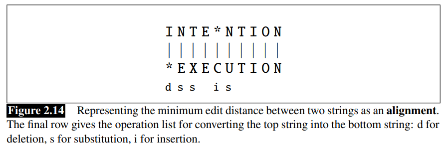
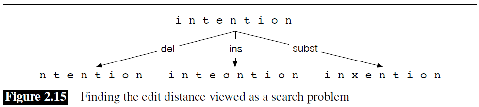
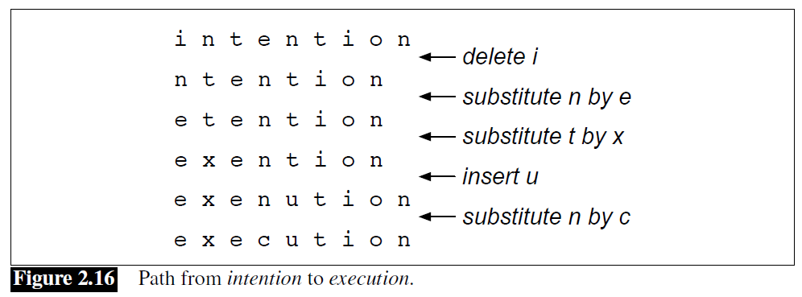
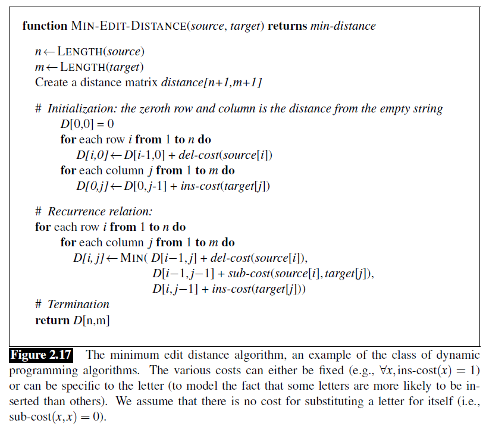
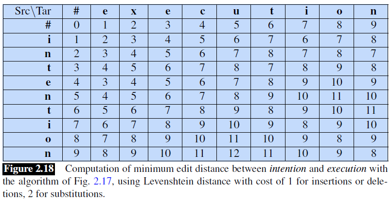
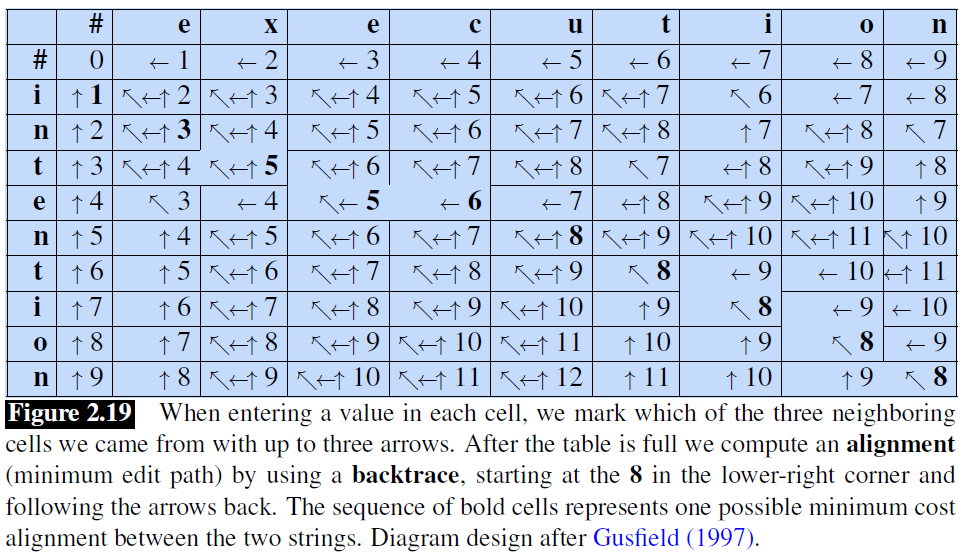

## 2.5 最小编辑距离（*Minimum Edit Distance*）

自然语言处理的很多内容是关于测量两个字符串的相似度的。例如在拼写纠正（*spelling correction*）中，用户会输入一些错误的字符串，比如说 `graff`，而我们想知道用户真正想要输入的词是什么。用户可能是想输入一个与 `graffe` 相似的词。在候选的相似词中，`giraffe` 这个词与 `graffe` 只相差一个字母，从直觉上看，它似乎比 `grail` 和 `graf` 更接近 `graffe`，因为后者相差的字母更多。另一个例子来自于**共指**（*coreference*），即确定以下两个字符串是否指的是同一个实体的任务：

```
Stanford President Marc Tessier-Lavigne
Stanford University President Marc Tessier-Lavigne
```

同样，这两个字符串非常相似（只相差一个字），这似乎是确定它们可能指代同一实体（*might be coreferent*）的有用证据。

**编辑距离**（*Edit distance*）给我们提供了一种方法来量化这种字符串相似性。正式来说，两个字符串之间的**最小编辑距离**（*minimum edit distance*）被定义为将一个字符串转化为另一个字符串时所需的最小编辑操作次数（插入、删除、替换等操作）。

例如，*intention* 和 *execution* 之间的差距是 5（删除一个 `i`，用 `e` 代替 `n`，用 `x` 代替 `t`，插入 `c`，用 `u` 代替 `n`）。将两个字符串**对齐**（*alignment*），如图 2.14 所示，可视化字符串之间的距离，可以更容易地看到这一点。给定两个序列，**对齐**就是两个序列的子串之间的对应关系。因此，我们说 `I` 与一个空字符串对齐，`N` 与 `E` 对齐，以此类推。在对齐的字符串下面是另一种表示方式；一系列符号表示将上层字符串转换为下层字符串所需的**操作列表**（*operation list*）：**d** 表示删除，**s** 表示替换，**i** 表示插入。



我们还可以为这些操作中的每一个操作分配一个特定的代价或权重。最简单的是 **Levenshtein** 距离，其中每一个操作的代价都是 1 (Levenshtein, 1966)[^1] —— 我们假设一个字母对其自身的替换的成本为 0，例如，`t` 对 `t` 的替换。*intention* 和 *execution* 之间的 Levenshtein 距离就是 5。 Levenshtein 还提出了这个度量标准的另一个版本，其中每个插入或删除的成本为 1，但不允许替换。（这相当于允许替换但其代价为 2，因为任何替换都可以用一个插入和一个删除来表示）。使用这个版本，*intention* 和 *execution* 之间的 Levenshtein 距离就是 8。

### 2.5.1 最小编辑距离算法（*The Minimum Edit Distance Algorithm*）

我们如何找到最小编辑距离？我们可以把它看作是一个搜索任务，在这个任务中，我们要寻找从一个字符串到另一个字符串的最短路径 —— 一个编辑序列。



所有可能的编辑的搜索空间是巨大的，所以我们不能天真地直接搜索。然而，很多不同的编辑路径最终会导致同一个状态（字符串）中，所以我们可以不重新计算这些路径，每当我们到达一个状态时，我们只需记住到达该状态的最短路径。我们可以通过使用**动态规划**（*dynamic programming*）来做到这一点。动态规划是一类算法的统称，最早由 Bellman (1957)[^2] 提出，使用表驱动（*table-driven*）的方法，通过组合子问题的解来解决一个大问题。自然语言处理中最常用的一些算法都利用了动态规划，如 **Viterbi** 算法（第 8 章）和用于 parsing 的 **CKY** 算法（第 13 章）。

动态规划的思想是，通过适当地组合各个子问题的解，可以得到一个大问题的解。考虑表示字符串之间最小编辑距离的字符串转换的最短路径问题，以 *intention* 和 *execution* 为例，如图 2.16 所示。



想象一个字符串（也许是 *exention*）在这个最优路径（不管它是什么）中。动态规划的思想是，如果 *exention* 在最优操作列表中，那么最优序列也必须包括从 *intention* 到 *exention* 的最优路径。为什么这么说呢？如果有一条从 *intention* 到 *exention* 的更短路径，那么我们可以用它来代替，从而导致整体路径更短，那么最优序列就不是最优的了，从而导致矛盾。

最小编辑距离算法算法由 Wagner and Fischer (1974)[^3] 命名，但是由许多人独立发现的（见第 8 章的 Historical Notes 部分）。

首先我们来定义两个字符串之间的最小编辑距离。给定两个字符串，即长度为 $n$ 的源字符串 $X$ 和长度为 $m$ 的目标字符串 $Y$，$D[i,j]$ 为 $X[1 \ldots i]$ 和 $Y[1 \ldots j]$ 之间的编辑距离，即 $X$ 的前 $i$ 个字符和 $Y$ 的前 $j$ 个字符，因此 $X$ 和 $Y$ 之间的编辑距离为 $D[n,m]$。

我们将利用动态规划自下而上地计算 $D[n,m]$，并结合子问题的解。在初始情况下，源子串长度为 $i$，但目标字符串为空，那么从 $i$ 个字符到 $0$ 个字符需要 $i$ 次删除。如果目标字符串是长度为 $j$ 的子串，但源字符串为空，那么从 $0$ 个字符到 $j$ 个字符，需要 $j$ 次插入。计算出小的 $i,j$ 对应的 $D[i,j]$ 后，我们再基于此计算大的 $D[i,j]$。具体来说，$D[i,j]$ 可以取三条可能路径中的最小路径的距离：

$$ D[i,j] = \text{min} \begin{cases}
    D[i-1,j] + \text{del-cost}(source[i]) \\
    D[i,j-1] + \text{ins-cost}(target[j]) \\
    D[i-1,j-1] + \text{sub-cost}(source[i],target[j])
\end{cases}$$

如果我们假设 Levenshtein 距离中，插入和删除的代价都是 1（$\text{ins-cost}(\cdot)=\text{del-cost}(\cdot)=1$），替换的代价是 2（除了相同字母的替换成本为零），那么 $$D[i,j]$$ 的计算就变成了：

$$ D[i,j] = \text{min} \begin{cases}
    D[i-1,j] + 1 \\
    D[i,j-1] + 1 \\
    D[i-1,j-1] + \begin{cases}
        2; \quad \text{if} \; source[i] \neq target[j] \\
        0; \quad \text{if} \; source[i] = target[j] 
    \end{cases}
\end{cases} \tag{2.8}$$

图 2.17 对该算法进行了总结；图 2.18 显示了使用公式 2.8 中的Levenshtein 距离版本来计算 *intention* 和 *execution* 之间的距离的结果。





了解最小编辑距离算法对于寻找潜在的拼写错误修正等算法很有用。但编辑距离算法在另一个方面也很重要，只要稍加改变，它也可以提供两个字符串之间的最小代价**对齐**（*alignment*）。在整个语音和语言处理过程中，字符串对齐都很有用。在语音识别中，最小编辑距离对齐被用来计算字错率（*word error rate*）（第 26 章）。对齐在机器翻译中也起着一定的作用，在机器翻译中，需要将平行语料库（*parallel corpus*）（语料库中的某段文本有两种语言的翻译）中的句子相互匹配。

为了扩展编辑距离算法以产生一个对齐，我们可以先利用编辑距离矩阵将一个对齐可视化为路径。图 2.19 显示了这个使用粗体字表示的路径。每个粗体字单元格代表两个字符串中一对字母的对齐。如果在同一行中出现两个粗体字的单元格，则在从源字符串到目标字符串的过程中会有插入；在同一列中出现两个粗体字的单元格则表示删除。



Gusfield (1997)[^4]

图 2.19 也显示了如何计算这个对齐路径。计算分两步进行。第一步，我们增强最小编辑距离算法，在每个单元格中存储反向指针（*backpointer*）。一个单元格的反向指针指向我们进入当前单元格时的前一个（或多个）单元格。我们已经在图 2.19 中展示了这些反向指针。有些单元格有多个反向指针，因为最小扩展（*extension*）可能来自于前面多个单元格。第二步，我们进行**回溯**（*backtrace*）。在回溯中，我们从最后一个单元格（在最后一行和最后一列）开始，沿着指针回溯动态规划矩阵。最后单元格和初始单元格之间的每一条完整路径都是一个最小距离对齐。练习 2.7 会要求你修改最小编辑距离算法，存储指针并计算回溯输出对齐。

当我们用简单的 Levenshtein 距离来做例子时，图 2.17 中的算法允许对操作进行任意加权。例如对于拼写校正（*spelling correction*），替换更有可能发生在键盘上相邻的字母之间。**Viterbi** 算法是最小编辑距离的概率扩展。Viterbi 算法不是计算两个字符串之间的“最小编辑距离”，而是计算一个字符串与另一个字符串之间的“最大概率对齐”（*maximum probability alignment*）。我们将在第 8 章详细讨论这个问题。

[^1]: Levenshtein, V. I. (1966). Binary codes capable of correcting deletions, insertions, and reversals. Cybernetics and Control Theory 10(8), 707–710. Original in Doklady Akademii Nauk SSSR 163(4): 845–848 (1965).  
[^2]: Bellman, R. (1957). Dynamic Programming. Princeton University Press.  
[^3]: Wagner, R. A. and Fischer, M. J. (1974). The string-to-string correction problem. Journal of the ACM 21, 168–173.  
[^4]: Gusfield, D. (1997). Algorithms on Strings, Trees, and Sequences: Computer Science and Computational Biology. Cambridge University Press.
