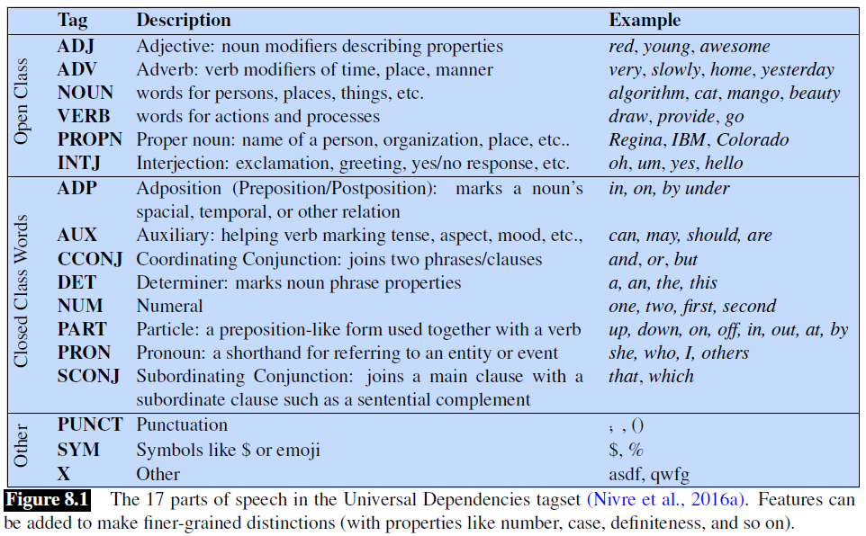

## 8.1 英语词类（*(Mostly) English Word Classes*）

到目前为止，我们一直在使用**名词**（*noun*）和**动词**（*verb*）等词性术语。在本节中，我们将给出更完整的定义。虽然词类（*word class*）确实有语义倾向 —— 例如形容词经常描述*属性*（*properties*），而名词则描述*人* —— 但词性的定义则是基于它们与相邻词的语法关系或关于其词缀的形态学属性。

词性可分为两大类：**封闭词类**（*closed class*）和**开放词类**（*open class*）。封闭词类是那些有相对固定成员的类别，如介词（*prepositions*） —— 很少会创造新的介词出来。相比之下，名词和动词则属于开放词类 —— 新的名词和动词如 *iPhone* 或 *to fax* 不断地被创造或借用。封闭词类一般是**虚词**（*function word*），如 *of*、*it*、*and* 或 *you*，这些词往往非常短，出现频率高，而且在语法中经常有结构性的用途。

世界上的语言有四个主要的开放词类：**名词**（包括专有名词）、**动词**、**形容词**和**副词**，以及较小的开放词类**感叹词**（*interjections*）。英语拥有所有这五种开放词类，但不是每种语言都是这样。

**名词**是指人、地方或事物的词，但也包括其他。**普通名词**（*Common nouns*）包括指代具体事物的术语，如 *cat* 和 *mango*，指代抽象事物的术语，如 *algorithm* 和 *beauty*，以及类似动词的术语，如句子 *His pacing to and fro became quite annoying* 中的 *pacing*。英语中的名词可以与定语（*a goat*，*its bandwidth*）一起出现，或者所有格（*译者注：possessives*）形式（*IBM’s annual revenue*），复数形式（*goats*，*abaci*）。许多语言，包括英语，将普通名词分为**可数名词**（*count nouns*）和**不可数名词**（*mass nouns*）。可数名词有单数和复数形式（*goat/goats*，*relationship/relationships*），并且可以被计数（*one goat*，*two goats*）。不可数名词是在某物被概念化为一个同质组（*homogeneous group*）时使用的。因此，*snow*、*salt* 和 *communism* 是不可数的（即\**two snows*或 \**two communisms*）。**专有名词**（*Proper nouns*），如 *Regina*、*Colorado* 和 *IBM*，是特定人或实体的名称。
