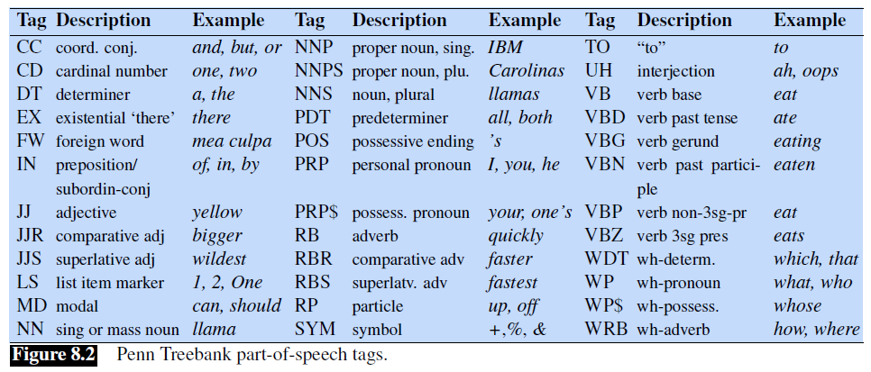

## 8.1 英语词类（*(Mostly) English Word Classes*）

到目前为止，我们一直在使用**名词**（*noun*）和**动词**（*verb*）等词性术语。在本节中，我们将给出更完整的定义。虽然词类（*word class*）确实有语义倾向 —— 例如形容词经常描述*属性*（*properties*），而名词则描述*人* —— 但词性的定义则是基于它们与相邻词的语法关系或关于其词缀的形态学属性。


词性可分为两大类：**封闭词类**（*closed class*）和**开放词类**（*open class*）。封闭词类是那些有相对固定成员的类别，如介词（*prepositions*） —— 很少会创造新的介词出来。相比之下，名词和动词则属于开放词类 —— 新的名词和动词如 *iPhone* 或 *to fax* 不断地被创造或借用。封闭词类一般是**虚词**（*function word*），如 *of*、*it*、*and* 或 *you*，这些词往往非常短，出现频率高，而且在语法中经常有结构性的用途。

世界上的语言有四个主要的开放词类：**名词**（包括专有名词）、**动词**、**形容词**和**副词**，以及较小的开放词类**感叹词**（*interjections*）。英语拥有所有这五种开放词类，但不是每种语言都是这样。

**名词**是指人、地方或事物的词，但也包括其他。**普通名词**（*Common nouns*）包括指代具体事物的术语，如 *cat* 和 *mango*，指代抽象事物的术语，如 *algorithm* 和 *beauty*，以及类似动词的术语，如句子 *His pacing to and fro became quite annoying* 中的 *pacing*。英语中的名词可以与定语（*a goat*，*its bandwidth*）一起出现，或者所有格（*译者注：possessives*）形式（*IBM’s annual revenue*），复数形式（*goats*，*abaci*）。许多语言，包括英语，将普通名词分为**可数名词**（*count nouns*）和**不可数名词**（*mass nouns*）。可数名词有单数和复数形式（*goat/goats*，*relationship/relationships*），并且可以被计数（*one goat*，*two goats*）。不可数名词是在某物被概念化为一个同质组（*homogeneous group*）时使用的。因此，*snow*、*salt* 和 *communism* 是不可数的（即\**two snows*或 \**two communisms*）。**专有名词**（*Proper nouns*），如 *Regina*、*Colorado* 和 *IBM*，是特定人或实体的名称。

**动词**（*Verbs*）指的是动作和过程，包括主动词（*main verbs*），如 *draw*、*provide* 和 *go*。英语动词都有词形变化（非第三人称单数（*eat*），第三人称单数（*eats*），进行时（*eating*），过去分词（*eaten*））。虽然许多学者认为所有的人类语言都有名词和动词的类别，但也有人认为有些语言，如印尼廖内语（*Riau Indonesian*）和汤加语（*Tongan*），甚至没有这种区别（Broschart 1997[^1]；Evans 2000[^2]；Gil 2000[^3]）。

**形容词**（*Adjectives*）通常用来描述名词的属性或品质，如颜色（*white*、*black*）、年龄（*old*、*young*）和质量（*good*、*bad*），但也有一些语言没有形容词。例如，在韩语中，与英语形容词相对应的词是作为动词的一个子类，因此英语中的形容词“beautiful”在韩语中就像一个动词，意思是“to be beautiful”。

**副词**（*Adverbs*）是一个大杂烩（*hodge-podge*）。下面这个例子中所有斜体字都是副词：

*Actually*, I ran *home extremely quickly yesterday*

副词通常用来修饰某些东西（通常是动词，因此被称为“adverb”，但也包括其他副词和整个动词短语）。**方位副词**（*Directional adverbs or locative adverbs*）（*home*、*here*、*downhill*）指明某些行动的方向或位置；**程度副词**（*degree adverbs*）（*extremely*、*very*、*somewhat*）表示某些行动、过程或属性的程度；**情态副词**（*manner adverbs*）（*slowly*、*slinkily*、*delicately*）描述某些行动或过程的情形或状态；**时间副词**（*temporal adverbs*）描述某些行动或事件发生的时间（*yesterday*、*Monday*）。

> 译者注：
> [*ad-*](https://www.dictionary.com/browse/ad-) 是一个来自拉丁语的前缀，表示“to, toward”，通常表示方位和趋势等。例如 *adventure* 就是 *ad* + *venture*，即“to venture”，去冒险。

感叹词（*Interjections*）（*oh*、*hey*、*alas*、*uh*、*um*）是一个较小的开放词类，它还包括问候语（*hello*、*goodbye*）和问题回答（*yes*、*no*、*uh-huh*）。

英语介词（*adpositions*）出现在名词之前，因此被称为**介词**（*prepositions*）。它们可以表示空间或时间关系，无论是字面上的（*on it*、**before then*、*by the house*）还是隐喻的（*on time*、*with gusto*、*beside herself*），以及像 *Hamlet was written **by** Shakespeare* 中的关系标记。

> 译者注：
> 根据 [Wikipedia](https://zh.wikipedia.org/wiki/%E4%BB%8B%E8%A9%9E) 的说法，preposition 实际上指的是前置介词，adposition 才是对介词/介系词的统称，adposition = preposition + postposition（后置介词） + circumposition（框式介词）。大部分介词都是前置介词，但也有一些情况会将介词后置，例如问句 *Where are you from?*。

**助词**（*particle*）类似于介词或副词，与动词结合使用。助词往往有一些延伸的意义，所以它们与类似介词并不完全相同，如 *she turned the paper over* 中的 *over*。一个动词和一个助词作为一个整体时被称为**短语动词**（*phrasal verb*）。短语动词的意义通常是**非组合性的**（*non-compositional*）—— 不能根据动词和助词的单独意义预测出来。因此，*turn down* 意思是“reject”，*rule out* 意思是 “eliminate”，而 *go on* 意思是“continue”。

像 *this* 和 *that*（*this chapter*、*that page*）这样的**定语**（*Determiners*）是英语名词短语开始的标记。像 *a*、*an* 和 *the* 这种冠词（*Articles*）是一种用于标记名词话语属性（*discourse properties*）的定语，而且使用相当频繁；实际上，*the* 是书面英语中最常见的词，*a* 和 *an* 紧随其后。

**连词**（*Conjunctions*）用于连接两个短语、分句（*clauses*）或句子。并列连词（*coordinating conjunctions*）如 *and*、*or* 和 *but* 连接两个地位相同的元素。当其中一个元素具有某种嵌入式含义时，就使用从属连词（*Subordinating conjunctions*）。例如，“I thought that you might like some milk”中的从属连词 *that* 将主句 *I thought* 与从句（*subordinate clause*） *you might like some milk* 连接起来。这个分句被称为从句，是因为这整个分句都是主动词 *thought* 的“内容”。像 *that* 这样把动词和其论元（*argument*）联系起来的从属连词，也被称为**补语连词**[^4]（*complementizers*）。

**代词**（*Pronouns*）用于指代一个实体或事件。人称代词（*Personal pronouns*）指代人或实体（*you*、*she*、*I*、*it*、*me* 等等）。物主代词（*Possessive pronouns*）是人称代词的一种形式，表示实际占有，或者更多的时候只是表示人和某些物体之间的抽象关系（*my*、*your*、*his*、*her*、*its*、*one’s*、*our*、*their*）。

> 译者注：物主代词也叫人称代词的所有格，又可分为形容词性物主代词和名词性物主代词，上面的例子中，*his*、*her*、*its* 既可以做形容词性物主代词也可以做名词性物主代词，其他都是形容词性物主代词。除此之外，名词性物主代词的例子有：*mine*、*yours*、*theirs*。

Wh 代词（*what*、*who*、*whom*、*whoever*）用于某些问句，或者作为补语连词（*Frida, who married Diego...*）。

**助动词**（*Auxiliary verbs*）表示主动词的语义特征，如它的时态，是否完成（体（*aspect*）），是否被否定（极性（*polarity*）），以及一个动作是否是必要的、可能的、建议的或期望的（语气（*mood*））。英语助动词包括**系词**（*copula*）be，以及 *do* 和 *have*，形式，以及用于标记与主动词所描述的事件相关的情态的**情态动词**（*modal verbs*）：*can* 表示能力或可能性，*may* 表示允许或可能性，*must* 表示必要性。

图 8.2 所示内容是一个英语专用标签集，即包含 45 个标签的 Penn Treebank 标签集 (Marcus et al., 1993)[^5]，已经被用来标记许多像 Penn Treebank 语料库这样的句法注释语料，所以值得了解以下。



下面我们展示了一些例子，每个词都根据 UD[^6] 和 Penn 标签集进行了标记。请注意，Penn 标签集区分了动词的时态和分词，并对英语中表存在的 *there* 结构有一个特殊的标签。此外，由于 *New England Journal of Medicine* 是一个专有名词，两个标签集都将其中的名词标记为 NNP，包括 *journal* 和 *medicine*，否则它们可能被标记为普通名词（NOUN/NN）。

> 译者注：第一个是 UD 结果，第二个是 Penn 结果。

```
(8.1)
There/PRO/EX are/VERB/VBP 70/NUM/CD children/NOUN/NNS
there/ADV/RB ./PUNC/.

(8.2)
Preliminary/ADJ/JJ findings/NOUN/NNS were/AUX/VBD reported/VERB/VBN in/ADP/IN today/NOUN/NN ’s/PART/POS New/PROPN/NNP England/PROPN/NNP Journal/PROPN/NNP of/ADP/IN Medicine/PROPN/NNP
```

[^1]: Broschart, J. (1997). Why Tongan does it differently. Linguistic Typology 1, 123–165.  
[^2]: Evans, N. (2000). Word classes in the world’s languages. Booij, G., Lehmann, C., and Mugdan, J. (Eds.), Morphology: A Handbook on Inflection and Word Formation, 708–732. Mouton.  
[^3]: Gil, D. (2000). Syntactic categories, cross-linguistic variation and universal grammar. Vogel, P. M. and Comrie, B. (Eds.), Approaches to the Typology of Word Classes, 173–216. Mouton.  
[^4]: 译者注：**补语连词** 这个翻译参考 邓思颖. (2000). [自然语言的词序和短语结构理论](https://core.ac.uk/download/pdf/61165967.pdf). 当代语言学, 3, 138-154.  
[^5]: Marcus, M. P., Santorini, B., and Marcinkiewicz, M. A. (1993). Building a large annotated corpus of English: The Penn treebank. Computational Linguistics 19(2), 313–330.  
[^6]: 译者注：[Universal POS tags](https://universaldependencies.org/u/pos/)