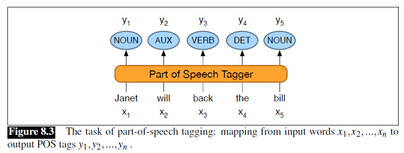

## 8.2 词性标注（*Part-of-Speech Tagging*）

**词性标注**（*Part-of-speech tagging*）是为文本中的每个单词分配一个词性的过程。输入是一个（分词后的）词序列 $x_1,x_2,\ldots,x_n$ 和一个标签集，输出为标签序列 $y_1,y_2,\ldots,y_n$，每个输出 $y_i$ 对应于一个输入 $x_i$，如图 8.3 所示。

标注是一项**消歧**（*disambiguation*）任务；单词的意义是有歧义的 —— 可能有一个以上的词性，目标是找到适合当前语境的标注。例如，*book* 可以是一个动词（*book that flight*）或一个名词（*hand me that book*）。*That* 可以是一个定语（*Does that flight serve dinner*），也可以是一个补语连词（*I thought that your flight was earlier*）。词性标注的目标是**解析**（*resolve*）这些歧义，为当前语境选择一个适当的标注。

词性标注算法的**准确率**（*accuracy*）（在测试集上与人类标注匹配的百分比）非常高。一项研究发现，Universal Dependency（UD）树库（*treebank*）在 15 种语言中的准确率超过 97% (Wu and Dredze, 2019)[^1]。其他各种英语树库的准确度也为 97%（无论用什么算法；HMM、CRF、BERT 的表现都相似）。这个 97% 也是人类在此任务上的水平，至少对于英语而言 (Manning, 2011)[^2]。

> 译者注：关于上面说的 15 种语言在 UD 上的准确率超过 97%：
>
> 1. 这是一个平均结果，其中德语和荷兰语（*nl*，*Dutch*）的结果是低于 97% 的。
> 2. 汉语不在这 15 种语言中。
> 
> 

[^1]: Wu, S. and Dredze, M. (2019). Beto, Bentz, Becas: The surprising cross-lingual effectiveness of BERT. EMNLP.  
[^2]: Manning, C. D. (2011). Part-of-speech tagging from 97% to 100%: Is it time for some linguistics?. CICLing 2011.

