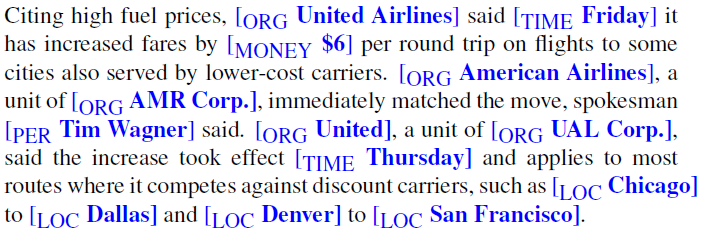
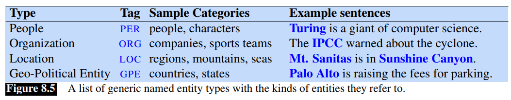
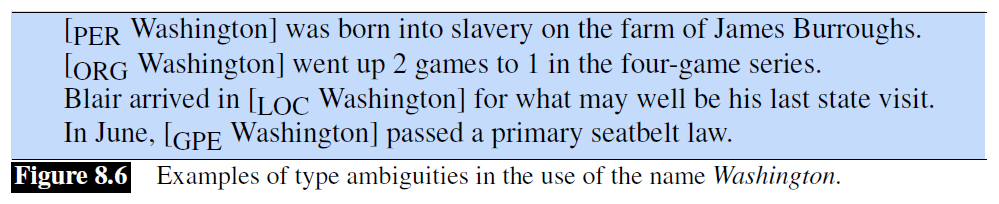
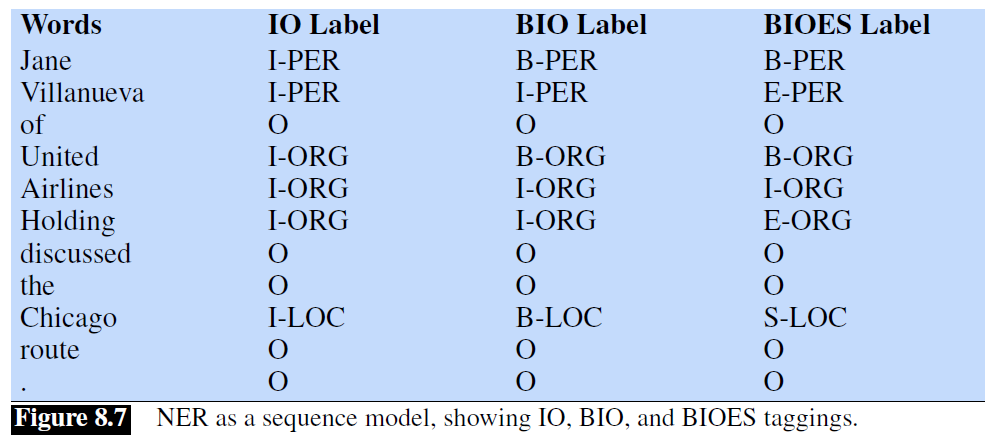

## 8.3 命名实体和命名实体标注（*Named Entities and Named Entity Tagging*）

词性标注可以告诉我们，像 *Janet*、*Stanford University* 和 *Colorado* 这样的词都是专有名词；专有名词是这些词的一个语法属性。但是从语义的角度来看，这些专有名词指的是不同种类的实体。*Janet* 是一个人，*Stanford University* 是一个组织，而 *Colorado* 是一个地点。

粗略地说，一个**命名实体**（*named entity*）是指任何可以用专有名词来指代的东西：一个人、一个地点、一个组织。**命名实体识别**（*named entity recognition*）（**NER**）任务是找到构成专有名词的文本跨度并标注实体的类型。最常见的四个实体标签是：**PER**（人物），**LOC**（地点），**ORG**（组织），或 **GPE**（地缘政治实体（*geo-political entity*））。然而，**命名实体**这一术语通常被扩展到包括那些本身不是实体的东西，包括日期、时间和其他种类的时间表达，甚至包括像价格这样的数字表达。下面是一个 NER 标注器输出的例子：

该例子共包含 13 个命名实体，包括 5 个组织、4 个地点、2 个时间、1 个人物和 1 次提到金钱。图 8.5 显示了典型的通用命名实体类型。许多应用还需要使用特定的实体类型，如蛋白质、基因、商业产品或艺术作品。

命名实体标注是许多自然语言理解任务中的第一步，作用很大。在情感分析中，我们可能想知道消费者对一个特定实体的情感。实体是问答系统以及将文本与维基百科等结构化知识来源中的信息联系起来中的第一阶段。而命名实体标注也是建立语义表征的自然语言理解任务的核心，如提取事件和参与者之间的关系。

与词性标注不同，词性标注没有分割问题，因为每个词都有一个标记，而命名实体识别的任务是寻找和标注一个文本*跨度*（*span*），其困难部分是由于分割的模糊性；我们需要决定什么是实体，什么不是，以及边界在哪里。事实上，文本中的大多数词都不是命名实体。另一个困难是由类型的模糊性造成的。提到 `JFK`，可以是指一个人，也可以是指纽约的机场，还可以是指美国各地的学校、桥梁、以及其他的东西的编号。图 8.6 中给出了这种跨类型混淆（*cross-type confusion*）的一些例子：

对于像 NER 这样的跨度识别问题（*span-recognition problem*），序列标注的标准方法是 **BIO** 标注 (Ramshaw and Marcus, 1995)[^1]。这是一种可以让我们把 NER 当作一个逐字序列标注任务的方法，通过标签来捕捉边界和命名实体类型。考虑下面这个句子：

图 8.7 显示了分别用 BIO、IO、BIOES 进行标注的结果，后两者都是 BIO 的变体。在 BIO 标注中，我们对任何感兴趣跨度的*开始* token 标注为 `B`，在该跨度*内*出现的 token 被标注为 `I`，而任何跨度之外的 token 都被标注为 `O`。对于不同的命名实体类别，只有一个 `O` 标签，但有不同的 `B` 和 `I` 标签。因此，标签的总数量是 $2n+1$，其中 $n$ 是实体类别的数量。BIO 标签可以表示与方括号表示法（*上面例子中的表示法*）完全相同的信息，但有一个优点，即我们可以用同样简单的序列建模方式来表示该任务：为每个输入词 $x_i$ 分配一个标签 $y_i$：

我们还展示了两种不同的标注方案：IO 标注，由于取消了 `B` 标签而损失了一些信息，而 BIOES 标注则在跨度的末尾增加了一个标签 `E` 表示跨度的结束，`S` 表示仅由一个词组成的跨度。一个序列标注器（HMM、CRF、RNN 和 Transformer 等）被训练用来给文本中的每个 token 贴上标签，这些标签表示存在（或不存在）特定种类的命名实体。

[^1]: Ramshaw, L. A. and Marcus, M. P. (1995). Text chunking using transformation-based learning. Proceedings of the 3rd Annual Workshop on Very Large Corpora.  
