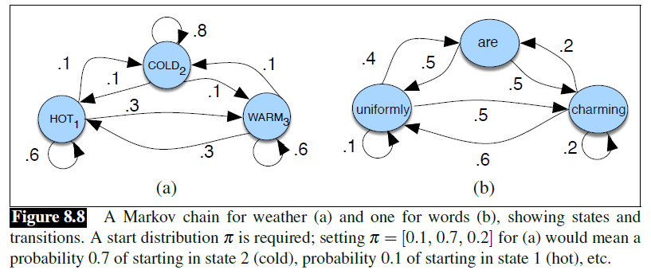

## 8.4 HMM 词性标注（*HMM Part-of-Speech Tagging*）

在这一节中，我们将会介绍我们的第一个序列标注算法，即隐马尔可夫模型（*Hidden Markov Model*），并展示如何将其应用于词性标注。简单回顾一下，一个序列标注器的任务是为序列中的每个单元分配一个标签，从而将一个观察序列（*sequence of observations*）映射到一个相同长度的标签序列。HMM 是一个经典模型，它引入了序列建模的许多关键概念，我们将在更多现代模型中再次看到这些概念。

HMM 是一个概率序列模型：给定一个单元序列（单词、字母、语素和句子等任何东西），它会计算所有可能的标签序列服从的概率分布，并选择最佳的那个标签序列。

### 8.4.1 马克可夫链（*Markov Chains*）

HMM 是一种加强版的马尔可夫链。**马尔可夫链**（*Markov chain*）模型可以告诉我们关于随机变量或者随机*状态*（*states*）序列的概率，其中每一个值都可以从一些集合中取。这些集合可以是词、标签，或者代表任何东西的符号，例如天气。马尔可夫链做了一个非常强的假设，即如果我们想预测该序列未来的某个状态，那么唯一重要的是当前状态。在当前状态之前的所有状态都对未来没有影响，只有当前状态会影响未来状态。这就好像要预测明天的天气一样，你可以根据今天的天气来预测，但你不能根据昨天的天气。

更正式地说，考虑一个状态变量序列 $q_1,q_2,\ldots,q_i$。马尔可夫模型关于这个序列的概率的**马尔科夫假设**（*Markov assumption*）体现在：当预测未来时，过去并不重要，只有现在才重要。

$$马尔可夫假设：P(q_i = a | q_1 \ldots q_{i-1}) = P(q_i = a | q_{i-1}) \tag{8.3}$$

图 8.8a 显示了一个马尔可夫链，用于为一个天气事件序列分配概率，其中的词汇表包括 `HOT`、`COLD` 和 `WARM`。图中的节点表示状态，而边表示状态转移及其概率。转移是一种概率：从一个状态出发的所有弧线的值的和必须为 1。图 8.8b 显示了一个用于给词序列 $w_1, \ldots, w_t$ 分配概率的马尔可夫链。这个马尔可夫链想必已经很熟悉了；事实上，它表示的是一个二元语言模型（*bigram language model*），每条边表示概率 $p(w_i|w_j)$。根据图 8.8 中的两个模型，我们可以给我们词汇表中的任何序列分配一个概率。



从形式上看，马尔可夫链是由以下部分组成的：

| $Q = q_1 q_2 \ldots q_N$ | $N$ 个**状态**（*states*）的集合 |
|---|---|
| $A = a_{11} a_{12} \ldots a_{N1} \ldots a_{NN}$ | 转移概率矩阵（*transition probability matrix*）$A$，每一个 $a_{ij}$ 表示从状态 $i$ 转移到状态 {j} 的概率，s.t. $\Sigma_{j=1}^{n} a_{ij} \; \forall{i}$ |
| $\pi = \pi_1, \pi_2, \ldots, \pi_N$ | 状态所服从的**初始概率分布**（*initial probability distribution*），$\pi_i$ 表示马尔可夫链从状态 {i} 开始的概率。一些状态 $j$ 可能有 $\pi_j = 0$，意味着它们不可能是初始状态。另外，$\Sigma_{i=1}^{N} \pi_i = 1$|

在继续之前，请使用图 8.8a 中的样本概率（$\pi = [0.1, 0.7, 0.2]$）来计算以下每个序列的概率：

```
(8.4)
hot hot hot hot

(8.5)
cold hot cold hot
```

这些概率的差异告诉了你一个被编码在图 8.8a 中的关于真实世界的天气事实，那么这个事实是什么？

### 8.4.2 隐马尔可夫模型（*The Hidden Markov Model*）
