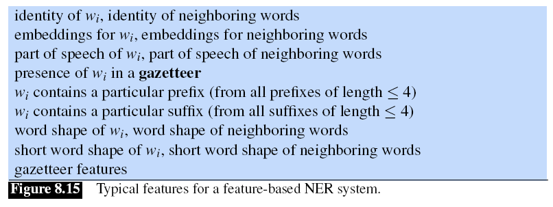
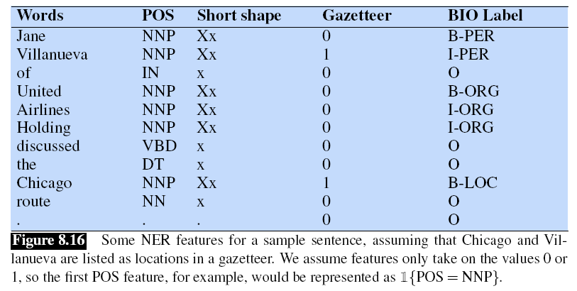

## 8.5 条件随机场 CRF（*Conditional Random Fields (CRFs)*）

虽然 HMM 是一个有用且强大的模型，但事实证明，HMM 需要使用大量增强方法才能达到高准确率。例如，在 POS 标注和其他任务中，我们经常遇到**未登录词**（*unknown words*）：专有名词和缩略语的产生非常频繁，甚至新的普通名词和动词也以惊人的速度被创造出来。如果有办法添加任意的特征来帮助解决这个问题，那就太好了。也许是基于大写字母或形态学（以大写字母开头的词很可能是专有名词，以 *-ed* 结尾的词往往是过去式（VBD 或 VBN）等），或许前面或后面的词也可能是一个有用的特征（如果前面的词是 *the*，那么当前词的词性标签不太可能是动词）。

尽管我们可以尝试“魔改” HMM，以找到可以加入其中一些特征的方法。但一般来说，像 HMM 这样的**生成模型**（*generative*）很难将任意特征直接添加到模型中。之前我们已经看到过一种原则上可以加入任意特征的模型：对数线性模型，如第五章的逻辑回归模型！但是，逻辑回归并不是一个序列模型：它只为单个观察值分配一个类别。

不过幸运的是，有一种基于对数线性模型的**判别式**（*discriminative*）序列模型：**条件随机场**（*conditional random field，CRF*）。我们将在这里描述的是**线性链 CRF**（*linear chain CRF*），这是最常用于语言处理的 CRF 版本，也是与 HMM 的条件最接近的版本。

假设我们有一个词构成的输入序列 $X = x_1^n = x_1 \ldots x_n$，并且想要 计算输出标签序列 $Y = y_1^n = y_1 \ldots y_n$。在 HMM 中，要计算出最佳标签序列，即最大化 $P(Y|X)$ 最大化，我们依靠的是贝叶斯定理和似然 $P(X|Y)$：

$$ 
\begin{aligned}
    \hat{Y} &= \argmax_Y p(Y|X) \\
    &= \argmax_Y p(X|Y)p(Y) \\
    &= \argmax_Y \prod_i p(x_i|y_i) \prod_i p(y_i|y_{i-1})
\end{aligned}
\tag{8.21}
$$

相比之下，在 CRF 中，我们直接计算后验概率 $p(Y|X)$，训练 CRF 使其能在可能的标签序列中找到最佳序列：

$$\hat{Y} = \argmax_{Y \in \mathscr{Y}} P(Y|X) \tag{8.22}$$

然而，CRF 并没有在每个时间步骤为每个标签计算出一个概率。相反，在每个时间步骤中，CRF 在一组相关特征上应用对数线性函数。这些局部特征（*local features*）被汇总并归一化，以产生整个序列的全局概率。

下面我们正式定义一下 CRF，同样使用 $X$ 和 $Y$ 作为输入和输出序列。CRF 是一个对数线性模型，给定整个输入序列 $X$，在所有可能的序列 $\mathscr{Y}$ 中，计算每个输出（标签）序列 $Y$ 的概率。我们可以将 CRF 视为一个大型的多项逻辑回归（*multinomial
logistic regression*），只不过原来的多项逻辑回归是针对单个 token 的。回想一下，原来的多项逻辑回归中的特征函数 $f$ 将一个 token $x$ 和一个标签 $y$ 组成的元组，映射成一个特征向量。在 CRF 中，这个函数 $F$ 将整个输入序列 $X$ 和整个输出序列 $Y$ 映射为一个特征向量。我们假设我们有 $K$ 个特征，每个特征 $F_k$ 有一个权重 $w_k$：

$$p(Y|X) = \dfrac{\exp \left(\sum_{k=1}^K w_kF_k(X, Y)\right)}{\sum_{Y' \in \mathscr{Y}} \exp \left(\sum_{k=1}^K w_kF_k(X, Y')\right)} \tag{8.23}$$

通常我们会单独把分母提出来，单独成一个函数 $Z(X)$：

$$p(Y|X) = \dfrac{1}{Z(X)}\exp \left(\sum_{k=1}^K w_kF_k(X, Y)\right) \tag{8.24}$$

$$Z(X) = \sum_{Y' \in \mathscr{Y}} \exp \left(\sum_{k=1}^K w_kF_k(X, Y')\right) \tag{8.25}$$

这 $K$ 个函数 $F_k(X, Y)$ 中，每一个都是整个输入序列 $X$ 和输出序列 $Y$ 的属性（*property*），所以我们将这些函数称为**全局特征**（*global features*）。我们将其分解成 $Y$ 中每个位置 $i$ 的**局部**特征，然后求和来计算这些全局特征：

$$F_k(X, Y) = \sum_{i=1}{n} f_k(y_{i-1}, y_i, X, i) \tag{8.26}$$

线性链 CRF 中的每个局部特征 $f_k$ 都会利用当前的输出 token $y_i$，先前的输出 token $y_{i-1}$，整个输入序列 $X$（或其一部分），以及当前位置 $i$。这种只能依赖于当前和以前的输出 token $y_i$ 和 $y_{i-1}$ 的限制是线性链 CRF 的特点。接下来我们可以看到，这种限制使我们可以使用 HMM 中的 Viterbi 和Forward-Backwards 算法的高效版本。相比之下，一般的 CRF 允许一个特征使用任何输出 token，因此对于需要依赖远期输出 token 的任务是必要的，如 $y_{i-4}$。这种一般的 CRF 需要更复杂的推理，语言处理中并不常见。

### 8.5.1 CRF 词性标注器中的特征（*Features in a CRF POS Tagger*）

判别式序列模型的一个优点是它更容易纳入大量特征，所以让我们来仔细研究一下这些特征。[^1]

我们来回忆一下，在线性链 CRF 中，位置 $i$ 的每个局部特征 $f_k$ 可以依赖于以下任何信息：$(y_{i-1}, y_i, X, i)$。一些常见的合法特征如下：

$$
\begin{cases}
    \mathbb{I}\{{x_i=the, y_i=\text{DET}}\} \\
    \mathbb{I}\{{y_i=\text{PROPN}, x_{i+1}=Street, y_{i-1}=\text{NUM}}\} \\
    \mathbb{I}\{{y_i=\text{VERB}, y_{i-1}=\text{AUX}}\} \\
    
\end{cases}
$$

为简单起见，我们假设所有 CRF 特征的值都是 1 或 0。我们使用符号 $\mathbb{I}$ 来表示“如果 $x$ 为真则为 1，否则为 0”。从现在开始，我们在定义特征时将默认省略 $\mathbb{I}$，但你可以认为每个特征都有一个隐含的 $\mathbb{I}$。

尽管使用什么特征这步是由系统设计者手工完成的，但具体的特征是使用**特征模板**（*feature templates*）自动得到的，我们在第五章中简单提到过。下面是一些只使用 $y_{i-1}, y_i, X, i$ 作为信息的模板：

$$\langle y_i, x_i \rangle, \langle y_i, y_{i-1} \rangle, \langle y_i, x_{i-1}, x_{i+2} \rangle$$

这些模板会自动从训练和测试集中的每个实例中提取特征集。因此对于我们的例子*Janet/NNP will/MD back/VB the/DT bill/NN*，当 $x_i$ 是 *back* 这个词时，就会产生以下特征，并且值为 1（我们给它们分配了一个随机特征编号）：

$$
f_{3743}: y_i = \text{VB} \; \text{and} \; x_i = \text{back} \\
f_{156}: y_i = \text{VB} \; \text{and} \; y_{i-1} = \text{MD} \\
f_{99732}: y_i = \text{VB} \; \text{and} \; x_{i-1} = \text{will} \; and \; x_{i+2} = \text{bill}
$$

拥有帮助处理未登录词的特征也很重要。其中最重要的是**字形特征**（*word shape*），它将词表示为抽象字母模式，将小写字母映射到“x”，大写字母映射到“X”，数字映射到“d”，并保留标点符号。因此，I.M.F 会映射为 X.X.X，DC10-30 会映射为 XXdd-dd。第二类较短的字形特征也会被使用。在这些特征中，连续的字符类型会被移除，因此全大写的单词映射为 X，首字母大写的单词映射为 Xx，DC10-30 将被映射为 Xd-d，但 I.M.F 仍将映射为X.X.X。总的来说，下面是一些能帮助处理未登录词的特征模板样例：

> $x_i$ 包含一个特定前缀（或许是所有长度 $\le 2$ 的前缀）  
> $x_i$ 包含一个特定后缀（或许是所有长度 $\le 2$ 的前缀）  
> $x_i$ 的字形  
> $x_i$ 的短字形

例如，单词 *well-dressed* 可能会生成以下非零特征值：

> prefix($x_i$) = `w`  
> prefix($x_i$) = `we`  
> suffix($x_i$) = `ed`  
> suffix($x_i$) = `d`  
> word-shape($x_i$) = `xxxx-xxxxxxx`  
> short-word-shape($x_i$) = `x-x`

已知词（*译者注：在词表中的词*）模板可以应用在训练集的每个词。未登录词的特征也可以应用在训练集中的所有词，或者只针对频率低于某个阈值的词。已知词模板和词签名（*word-signature*）特征的计算结果是一个非常大的特征集。一般来说，会使用一个特征截止点，如果特征在训练集中的频数 < 5，则被丢弃。

请记住，在 CRF 中，我们并没有为每个局部特征学习权重 $f_k$。相反，对于整个句子，我们首先将每个局部特征（例如特征 $f_{3743}$）的值相加，以形成全局特征（例如 $F_{3743}$）。然后这些全局特征再乘以权重 $w_{3743}$。因此，训练和推理时，即使每个句子的长度不同，也总是有一组固定的 $K$ 个特征和 $K$ 个权重。

> 译者注：将所有局部特征逐个应用在句子的所有 token 上，然后相加，得到局部特征对应的全局特征，然后乘上权重，得到最后特征。

### 8.5.2 用于命名实体识别的 CRF 特征（*Features for CRF Named Entity Recognizers*）

用于 NER 的 CRF 使用了与 POS 标注器非常相似的特征，如图 8.15 所示。

一个对地点特别有用的功能是**地名录**（*gazetteer*），这是一个地名清单，通常包括数百万个带有详细地理和政治信息的地点条目。[^2]这可以作为一个二进制特征来实现，表示一个短语是否出现在清单中。也可以使用其他相关资源，如来自美国人口普查局[^3]的**姓名列表**（*name-lists*），也可以使用其他实体词典，如公司或产品列表，尽管它们可能不像地名词典那样有帮助 (Mikheev et al., 1999)[^4]。

命名实体标记样本 *L'Occitane* 将产生以下非零特征值（假设 *L'Occitane* 既不在地名录中，也不在人口普查列表中）：

> prefix($x_i$) = L  
> prefix($x_i$) = L'  
> prefix($x_i$) = L'O  
> prefix($x_i$) = L'Oc  
> suffix($x_i$) = tane  
> suffix($x_i$) = ane  
> suffix($x_i$) = ne  
> suffix($x_i$) = e  
> word-shape($x_i$) = X'Xxxxxxxx  
> short-word-shape($x_i$) = X'Xx  

图 8.16 展示了在先前的例子中加入词性标签和一些形状信息的结果。

### 8.5.3 CRF 的推理和训练（*Inference and Training for CRFs*）

[^1]: 在 HMM 中，由于所有的计算都是基于两个概率 $P(tag|tag)$ 和 $P(word|tag)$，所以如果我们想把一些知识源纳入标注过程，我们必须找到一种方法把知识编码到这两个概率中的一个。但我们每增加一个特征，都必须做大量的复杂的条件概率计算，随着我们有越来越多的这样的特征，这会变得越来越复杂。
[^2]: www.geonames.org
[^3]: www.census.gov
[^4]: Mikheev, A., Moens, M., and Grover, C. (1999). Named entity recognition without gazetteers. EACL.
